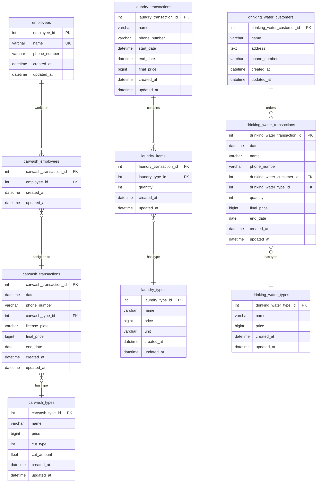

# Kharisma Abadi - Current Application Analysis

**Analysis Date:** October 22, 2025
**Analyst:** Claude Code
**Database Schema Version:** August 19, 2023
**Application Version:** Production (3+ years)

---

## Executive Summary

Kharisma Abadi is a production multi-service cashier system that has been successfully running for over 3 years, managing car wash, laundry, carpet washing, and drinking water delivery services. The application consists of a Flask/Python backend API, a Next.js/TypeScript frontend, and a MariaDB database containing critical business data.

### Key Technologies

**Backend:**
- Flask 2.3.2 (Python web framework)
- MariaDB 10.3 (MySQL-compatible database)
- Gunicorn 21.2.0 with gevent workers (WSGI server)
- Docker containerization

**Frontend:**
- Next.js 13.2.4 (React 18.2.0)
- TypeScript 5.0.3
- Material-UI v5 + Tailwind CSS v3
- Docker containerization

### Critical Findings

**Strengths:**
- ✅ Well-structured monorepo with clear separation of concerns
- ✅ Production-proven with 3+ years of stable operation
- ✅ Comprehensive database schema with proper relationships
- ✅ Docker-based deployment for consistency
- ✅ Automated database backups with cloud storage
- ✅ Recent performance optimizations (pagination, bulk queries)
- ✅ Good documentation coverage

**Concerns:**
- ⚠️ **Outdated dependencies** with potential security vulnerabilities
- ⚠️ **No authentication/authorization system** - security risk
- ⚠️ **No automated testing** - increases risk during modifications
- ⚠️ **Mixed data access patterns** - some N+1 queries remain
- ⚠️ **Limited error handling** and logging
- ⚠️ **Next.js 13 (Pages Router)** - approaching legacy status
- ⚠️ **No API rate limiting** or request validation middleware

---

## Table of Contents

1. [Backend Analysis](#1-backend-analysis)
2. [Frontend Analysis](#2-frontend-analysis)
3. [Database Schema Analysis](#3-database-schema-analysis)
4. [API Endpoints Inventory](#4-api-endpoints-inventory)
5. [Dependencies Analysis](#5-dependencies-analysis)
6. [Integration Points](#6-integration-points)
7. [Code Quality & Technical Debt](#7-code-quality--technical-debt)
8. [Security Assessment](#8-security-assessment)
9. [Performance Analysis](#9-performance-analysis)
10. [Recommendations](#10-recommendations)

---

## 1. Backend Analysis

### 1.1 Architecture Overview

**Pattern:** MVC (Model-View-Controller)
- **Controllers** (`controller/`) - Route handlers using Flask Blueprints
- **Models** (`model/`) - Database access layer with direct SQL queries
- **No View layer** - API returns JSON only

**Entry Point:** `app.py`
- Flask application initialization
- CORS configuration (allows all origins)
- Database configuration via environment variables
- Blueprint registration for all modules

### 1.2 Directory Structure

```
be-kharisma-abadi/
├── controller/          # 10 controller files (Flask Blueprints)
├── model/              # 11 model files (DB access layer)
├── migrations/         # Database migration files
├── docs/              # Production deployment guides
├── scripts/           # Build and deployment scripts (Windows .bat)
├── mysql-config/      # MySQL configuration files
├── app.py             # Main application entry point
├── db_config.py       # Database connection management
├── gunicorn.conf.py   # Gunicorn server configuration
├── requirements.txt   # Python dependencies (31 packages)
├── Dockerfile         # Multi-stage Docker build
├── docker-compose.yml # Local development orchestration
└── database.sql       # Initial schema (reference only)
```

### 1.3 Key Components

#### Controllers (Flask Blueprints)
1. **dashboard_controller.py** - Business analytics and income reports
2. **employee_controller.py** - Employee CRUD and income tracking
3. **carwash_type_controller.py** - Car wash service types
4. **carwash_transaction_controller.py** - Car wash transactions
5. **laundry_type_controller.py** - Laundry/carpet service types
6. **laundry_transaction_controller.py** - Laundry/carpet transactions
7. **drinking_water_type_controller.py** - Water delivery types
8. **drinking_water_customer_controller.py** - Water customers
9. **drinking_water_transaction_controller.py** - Water deliveries
10. **type_controller.py** - General type management

#### Database Access Layer
- Direct SQL queries using Flask-MySQLdb
- Mix of raw SQL and helper functions
- Recent optimizations with JOINs to reduce N+1 queries
- Connection pooling via Flask-MySQLdb

#### Configuration Management
- Environment-based configuration via `.env` files
- Separate `.env` and `.env.production`
- Configuration includes: database credentials, CORS origins, Flask settings

### 1.4 Backend Technology Stack

| Component | Version | Purpose |
|-----------|---------|---------|
| Python | 3.x | Programming language |
| Flask | 2.3.2 | Web framework |
| Flask-MySQLdb | 1.0.1 | MySQL database connector |
| mysqlclient | 2.2.0 | MySQL client library |
| mysql-connector-python | 8.0.33 | Alternative MySQL connector |
| Gunicorn | 21.2.0 | WSGI HTTP server |
| gevent | 23.9.1 | Async networking library |
| Flask-CORS | 3.0.10 | Cross-Origin Resource Sharing |
| python-dotenv | 1.0.0 | Environment variable management |

### 1.5 Deployment Configuration

**WSGI Server (Gunicorn):**
- Worker class: `gevent` (async I/O)
- Bind address: `0.0.0.0:5000`
- Timeout: 600 seconds (10 minutes)
- Configuration file: `gunicorn.conf.py`

**Docker:**
- Multi-stage build for smaller image size
- Base image: Python 3.x
- Exposed port: 5000
- Health checks enabled in docker-compose

---

## 2. Frontend Analysis

### 2.1 Architecture Overview

**Framework:** Next.js 13.2.4 (Pages Router)
- File-based routing via `src/pages/`
- Server-side rendering (SSR) capable
- API routes for client-side data fetching
- Context-based state management

### 2.2 Directory Structure

```
E-Kharisma-Cashier-FE/
├── src/
│   ├── pages/                # Next.js pages (routes)
│   │   ├── index.tsx        # Dashboard
│   │   ├── _app.tsx         # App wrapper
│   │   ├── api/             # API client contexts (NOT Next.js API routes)
│   │   ├── cuci-mobil/      # Car wash pages
│   │   ├── laundry/         # Laundry pages
│   │   ├── karpet/          # Carpet pages
│   │   ├── air-minum/       # Water delivery pages
│   │   └── pengaturan/      # Settings pages
│   ├── components/          # Reusable React components
│   ├── types/              # TypeScript type definitions
│   ├── helpers/            # Utility functions
│   ├── constants/          # Shared constants
│   └── styles/             # Global styles
├── public/                 # Static assets
├── package.json           # NPM dependencies (24 prod + 4 dev)
├── tsconfig.json          # TypeScript configuration
├── next.config.js         # Next.js configuration
├── tailwind.config.js     # Tailwind CSS configuration
└── Dockerfile             # Standalone Next.js build
```

### 2.3 Key Features

#### Page Structure
- **Dashboard** (`/`) - Income summaries and charts
- **Car Wash** (`/cuci-mobil`) - List, create, detail views
- **Laundry** (`/laundry`) - List, create, detail views
- **Carpet** (`/karpet`) - List, create, detail views
- **Water Delivery** (`/air-minum`) - List, create, customer history
- **Settings** (`/pengaturan`) - Employee, customer, type management

#### API Integration Layer
Located in `src/pages/api/` (note: these are NOT Next.js API routes, but client-side API wrappers):
- React Context providers for each domain
- Axios-based HTTP client
- Centralized API calls
- State management via context

**API Contexts:**
- `Dashboard.tsx` - Dashboard analytics
- `Karyawan.tsx` - Employee data
- `CuciMobil.tsx` - Car wash data
- `Laundry.tsx` - Laundry data
- `AirMinum.tsx` - Water delivery data
- `PelangganAir.tsx` - Water customer data
- `JenisPekerjaan.tsx` - Job type data
- `ClientAPI.tsx` - Base API client

### 2.4 Frontend Technology Stack

| Component | Version | Purpose |
|-----------|---------|---------|
| Next.js | 13.2.4 | React framework |
| React | 18.2.0 | UI library |
| TypeScript | 5.0.3 | Type-safe JavaScript |
| Material-UI (MUI) | 5.11.15 | Component library |
| @mui/icons-material | 5.11.11 | Icon library |
| Tailwind CSS | 3.3.1 | Utility-first CSS |
| material-react-table | 1.9.3 | Data tables |
| Recharts | 2.6.2 | Charts and visualizations |
| Axios | 1.4.0 | HTTP client |
| Day.js | 1.11.7 | Date manipulation |
| react-hot-toast | 2.4.1 | Notifications |
| react-to-print | 2.14.13 | Print receipts |
| qrcode.react | 3.1.0 | QR code generation |

### 2.5 UI/UX Patterns

**Component Library:** Material-UI (MUI) v5
- Pre-built React components
- Theming support
- Responsive design

**Styling Approach:**
- Combination of MUI's `sx` prop
- Tailwind CSS utility classes
- Emotion for CSS-in-JS

**Data Tables:**
- `material-react-table` for complex tables
- Pagination support
- Search and sort functionality

**Forms:**
- Custom form components
- Input masking via `react-imask`
- Date pickers via `@mui/x-date-pickers`

---

## 3. Database Schema Analysis

### 3.1 Schema Overview

**Database:** `ka_backup` (MariaDB 10.4.27)
**Character Set:** utf8mb4
**Collation:** utf8mb4_general_ci
**Total Tables:** 9

### 3.2 Entity-Relationship Diagram

```
┌─────────────┐
│  employees  │
└──────┬──────┘
       │
       │ (many-to-many via carwash_employees)
       │
┌──────▼──────────────────┐       ┌─────────────────┐
│ carwash_employees       │       │ carwash_types   │
└──────┬──────────────────┘       └────────┬────────┘
       │                                   │
       │                                   │ (one-to-many)
       │                                   │
┌──────▼───────────────────────────────────▼─────┐
│        carwash_transactions                    │
└────────────────────────────────────────────────┘

┌──────────────────────┐       ┌─────────────────┐
│  laundry_items       │       │  laundry_types  │
└──────┬───────────────┘       └────────┬────────┘
       │                                │
       │ (many-to-many)                 │
       │                                │
┌──────▼────────────────────────────────▼────────┐
│        laundry_transactions                    │
└────────────────────────────────────────────────┘

┌────────────────────────────┐
│ drinking_water_customers   │
└─────────────┬──────────────┘
              │
              │ (one-to-many, optional)
              │
┌─────────────▼──────────────────────────────────┐
│     drinking_water_transactions                │
└─────────────┬──────────────────────────────────┘
              │
              │ (many-to-one)
              │
┌─────────────▼──────────┐
│ drinking_water_types   │
└────────────────────────┘
```

### 3.3 Table Definitions

#### 3.3.1 Employees Table

```sql
CREATE TABLE `employees` (
  `employee_id` int(11) NOT NULL AUTO_INCREMENT,
  `name` varchar(128) NOT NULL,
  `phone_number` varchar(18) DEFAULT NULL,
  `created_at` datetime NOT NULL,
  `updated_at` datetime NOT NULL DEFAULT current_timestamp(),
  PRIMARY KEY (`employee_id`),
  UNIQUE KEY `name` (`name`)
)
```

**Purpose:** Central employee registry
**Relationships:**
- One-to-many with `carwash_employees` (car wash job assignments)

**Key Constraints:**
- Unique name constraint (prevents duplicate employee names)
- Auto-incrementing primary key

#### 3.3.2 Car Wash Tables

**carwash_types** - Service type definitions
```sql
CREATE TABLE `carwash_types` (
  `carwash_type_id` int(11) NOT NULL AUTO_INCREMENT,
  `name` varchar(64) NOT NULL,
  `price` bigint(20) NOT NULL,
  `created_at` datetime NOT NULL,
  `updated_at` datetime NOT NULL DEFAULT current_timestamp(),
  `cut_type` int(11) DEFAULT 1,           -- 1=fixed amount, 2=percentage
  `cut_amount` float DEFAULT 0,           -- Employee cut
  PRIMARY KEY (`carwash_type_id`)
)
```

**carwash_transactions** - Car wash jobs
```sql
CREATE TABLE `carwash_transactions` (
  `carwash_transaction_id` int(11) NOT NULL AUTO_INCREMENT,
  `date` datetime NOT NULL,
  `phone_number` varchar(18) DEFAULT NULL,
  `carwash_type_id` int(11) NOT NULL,
  `license_plate` varchar(12) NOT NULL,
  `final_price` bigint(20) NOT NULL,
  `created_at` datetime NOT NULL,
  `updated_at` datetime NOT NULL DEFAULT current_timestamp(),
  `end_date` date DEFAULT NULL,           -- Completion date
  PRIMARY KEY (`carwash_transaction_id`),
  KEY `carwash_type_id` (`carwash_type_id`),
  CONSTRAINT `carwash_type_id` FOREIGN KEY (`carwash_type_id`)
    REFERENCES `carwash_types` (`carwash_type_id`)
)
```

**carwash_employees** - Many-to-many junction table
```sql
CREATE TABLE `carwash_employees` (
  `carwash_transaction_id` int(11) NOT NULL,
  `employee_id` int(11) NOT NULL,
  `created_at` datetime NOT NULL,
  `updated_at` datetime NOT NULL DEFAULT current_timestamp(),
  KEY `carwash_transaction_id` (`carwash_transaction_id`),
  KEY `employee_id` (`employee_id`),
  CONSTRAINT `carwash_transaction_id` FOREIGN KEY (`carwash_transaction_id`)
    REFERENCES `carwash_transactions` (`carwash_transaction_id`)
    ON DELETE CASCADE ON UPDATE CASCADE,
  CONSTRAINT `employee_id` FOREIGN KEY (`employee_id`)
    REFERENCES `employees` (`employee_id`)
    ON DELETE NO ACTION ON UPDATE NO ACTION
)
```

**Key Features:**
- Employee cut calculation (fixed amount or percentage)
- Cascade deletion on transaction removal
- License plate tracking

#### 3.3.3 Laundry Tables

**laundry_types** - Service types (both laundry and carpet)
```sql
CREATE TABLE `laundry_types` (
  `laundry_type_id` int(11) NOT NULL AUTO_INCREMENT,
  `name` varchar(128) NOT NULL,
  `price` bigint(20) NOT NULL,
  `unit` varchar(16) NOT NULL,            -- "pcs", "kg", "m", "m2"
  `created_at` datetime NOT NULL,
  `updated_at` datetime NOT NULL DEFAULT current_timestamp(),
  PRIMARY KEY (`laundry_type_id`)
)
```

**laundry_transactions** - Laundry/carpet jobs
```sql
CREATE TABLE `laundry_transactions` (
  `laundry_transaction_id` int(11) NOT NULL AUTO_INCREMENT,
  `name` varchar(128) DEFAULT NULL,       -- Customer name
  `phone_number` varchar(18) DEFAULT NULL,
  `start_date` datetime NOT NULL,
  `end_date` datetime DEFAULT NULL,       -- Completion date
  `final_price` bigint(20) NOT NULL,
  `created_at` datetime NOT NULL,
  `updated_at` datetime NOT NULL DEFAULT current_timestamp(),
  PRIMARY KEY (`laundry_transaction_id`)
)
```

**laundry_items** - Items in each transaction
```sql
CREATE TABLE `laundry_items` (
  `laundry_transaction_id` int(11) NOT NULL,
  `laundry_type_id` int(11) NOT NULL,
  `quantity` int(11) NOT NULL,
  `created_at` datetime NOT NULL,
  `updated_at` datetime NOT NULL DEFAULT current_timestamp(),
  KEY `laundry_transaction_id` (`laundry_transaction_id`),
  KEY `laundry_type_id` (`laundry_type_id`),
  CONSTRAINT `laundry_transaction_id` FOREIGN KEY (`laundry_transaction_id`)
    REFERENCES `laundry_transactions` (`laundry_transaction_id`)
    ON DELETE CASCADE ON UPDATE CASCADE,
  CONSTRAINT `laundry_type_id` FOREIGN KEY (`laundry_type_id`)
    REFERENCES `laundry_types` (`laundry_type_id`)
)
```

**Key Features:**
- No composite primary key on junction table (allows duplicate items)
- Unit-based differentiation (laundry: "pcs"/"kg", carpet: "m"/"m2")
- Cascade deletion on transaction removal

#### 3.3.4 Water Delivery Tables

**drinking_water_customers** - Customer registry
```sql
CREATE TABLE `drinking_water_customers` (
  `drinking_water_customer_id` int(11) NOT NULL AUTO_INCREMENT,
  `name` varchar(128) NOT NULL,
  `address` text NOT NULL,
  `phone_number` varchar(18) DEFAULT NULL,
  `created_at` datetime NOT NULL,
  `updated_at` datetime NOT NULL DEFAULT current_timestamp(),
  PRIMARY KEY (`drinking_water_customer_id`)
)
```

**drinking_water_types** - Product types
```sql
CREATE TABLE `drinking_water_types` (
  `drinking_water_type_id` int(11) NOT NULL AUTO_INCREMENT,
  `name` varchar(128) NOT NULL,
  `price` bigint(20) NOT NULL,
  `created_at` datetime NOT NULL,
  `updated_at` datetime NOT NULL DEFAULT current_timestamp(),
  PRIMARY KEY (`drinking_water_type_id`)
)
```

**drinking_water_transactions** - Delivery records
```sql
CREATE TABLE `drinking_water_transactions` (
  `drinking_water_transaction_id` int(11) NOT NULL AUTO_INCREMENT,
  `date` datetime NOT NULL,
  `name` varchar(128) DEFAULT NULL,       -- Walk-in customer name
  `phone_number` varchar(18) DEFAULT NULL,
  `drinking_water_customer_id` int(11) DEFAULT NULL,  -- Optional: registered customer
  `drinking_water_type_id` int(11) NOT NULL,
  `quantity` int(11) NOT NULL,
  `final_price` bigint(20) NOT NULL,
  `created_at` datetime NOT NULL,
  `updated_at` datetime NOT NULL DEFAULT current_timestamp(),
  `end_date` date DEFAULT NULL,           -- Completion date
  PRIMARY KEY (`drinking_water_transaction_id`),
  KEY `drinking_water_customer_id` (`drinking_water_customer_id`),
  KEY `drinking_water_type_id` (`drinking_water_type_id`),
  CONSTRAINT `drinking_water_customer_id` FOREIGN KEY (`drinking_water_customer_id`)
    REFERENCES `drinking_water_customers` (`drinking_water_customer_id`),
  CONSTRAINT `drinking_water_type_id` FOREIGN KEY (`drinking_water_type_id`)
    REFERENCES `drinking_water_types` (`drinking_water_type_id`)
)
```

**Key Features:**
- Optional customer linkage (supports both walk-ins and registered customers)
- Quantity-based pricing
- Address tracking for deliveries

### 3.4 Schema Analysis

**Strengths:**
- ✅ Proper foreign key relationships
- ✅ Cascade deletion for dependent records
- ✅ Timestamp tracking (created_at, updated_at)
- ✅ Flexible customer handling (registered vs walk-in)
- ✅ Clear naming conventions

**Weaknesses:**
- ⚠️ No indexes on frequently queried columns (date, end_date, phone_number)
- ⚠️ No composite primary keys where appropriate (laundry_items could use composite key)
- ⚠️ Inconsistent use of `end_date` (DATE vs DATETIME)
- ⚠️ No check constraints for data validation
- ⚠️ Large VARCHAR sizes (128 characters for names may be excessive)
- ⚠️ No soft delete mechanism (deleted records are permanently removed)

**Missing Features:**
- ❌ No audit trail for data changes
- ❌ No user/session tracking
- ❌ No transaction status enum (using NULL end_date as proxy)
- ❌ No payment tracking (paid/unpaid)
- ❌ No versioning or change history

---

## 4. API Endpoints Inventory

### 4.1 Base URL

**Production:** `http://localhost:5000/api`
**All endpoints prefixed with:** `/api`

### 4.2 Endpoint Summary

| Domain | Endpoints | Methods |
|--------|-----------|---------|
| Dashboard | 8 | GET, POST |
| Employees | 6 | GET, POST, PUT, DELETE |
| Car Wash Types | 5 | GET, POST, PUT, DELETE |
| Car Wash Transactions | 6 | GET, POST, PUT, DELETE |
| Laundry Types | 5 | GET, POST, PUT, DELETE |
| Laundry/Carpet Transactions | 8 | GET, POST, PUT, DELETE |
| Water Types | 5 | GET, POST, PUT, DELETE |
| Water Customers | 6 | GET, POST, PUT, DELETE |
| Water Transactions | 7 | GET, POST, PUT, DELETE |
| General Types | 1+ | GET |
| **Total** | **57+** | |

### 4.3 Detailed Endpoint List

#### 4.3.1 Dashboard Endpoints

| Endpoint | Method | Purpose | Params |
|----------|--------|---------|--------|
| `/api/dashboard/income/` | GET | Get all income summaries (today, month, year, total) | - |
| `/api/dashboard/total-income/` | GET | Get total all-time income | - |
| `/api/dashboard/today-income/` | GET | Get today's income | - |
| `/api/dashboard/month-income/` | GET | Get this month's income | - |
| `/api/dashboard/year-income/` | GET | Get this year's income | - |
| `/api/dashboard/chart-year/` | GET | Get available years for chart filtering | - |
| `/api/dashboard/chart-month/` | GET, POST | Get months for chart (optionally filtered by year) | year (optional) |
| `/api/dashboard/chart/year/` | POST | Get monthly income data for specific year | year, type |
| `/api/dashboard/chart/month/` | POST | Get daily income data for specific month | year, month, type |
| `/api/dashboard/debug/date/` | GET | Debug: Check database server date | - |
| `/api/dashboard/debug/transactions/` | GET | Debug: Check transaction counts | - |

**Chart Types:**
- `type=1` - Total (all services)
- `type=2` - Car wash only
- `type=3` - Laundry only
- `type=4` - Carpet only
- `type=5` - Drinking water only

#### 4.3.2 Employee Endpoints

| Endpoint | Method | Purpose | Params |
|----------|--------|---------|--------|
| `/api/employee/` | GET | List all employees (paginated or full) | page, per_page, search, sort_by, sort_order |
| `/api/employee/<id>/` | GET | Get employee details | - |
| `/api/employee-income/` | GET | List employees with income (today, month) | page, per_page, search, sort_by, sort_order |
| `/api/employee-income/<id>/` | POST | Get employee income by date range | start_date, end_date, page, per_page |
| `/api/employee/` | POST | Create new employee | name, phone_number |
| `/api/employee/<id>/` | PUT | Update employee | name, phone_number |
| `/api/employee/<id>/` | DELETE | Delete employee | - |

#### 4.3.3 Car Wash Endpoints

**Types:**
| Endpoint | Method | Purpose |
|----------|--------|---------|
| `/api/carwash-type/` | GET | List all car wash types |
| `/api/carwash-type/<id>/` | GET | Get specific type |
| `/api/carwash-type/` | POST | Create new type |
| `/api/carwash-type/<id>/` | PUT | Update type |
| `/api/carwash-type/<id>/` | DELETE | Delete type |

**Transactions:**
| Endpoint | Method | Purpose | Params |
|----------|--------|---------|--------|
| `/api/carwash-transaction/` | GET | List all transactions (paginated) | page, per_page, search, sort_by, sort_order |
| `/api/carwash-transaction/<id>/` | GET | Get transaction details | - |
| `/api/carwash-transaction-income/` | POST | Get transactions by date range | start_date, end_date |
| `/api/carwash-transaction/` | POST | Create new transaction | date, phone_number, carwash_type_id, license_plate, final_price, employee[] |
| `/api/carwash-transaction/<id>/` | PUT | Update transaction | (same as POST) |
| `/api/carwash-transaction/<id>/` | DELETE | Delete transaction | - |
| `/api/carwash-transaction/end-date/<id>/` | PUT | Mark transaction as completed | end_date |

#### 4.3.4 Laundry/Carpet Endpoints

**Types:**
| Endpoint | Method | Purpose | Notes |
|----------|--------|---------|-------|
| `/api/laundry-type/` | GET | List laundry types (excludes carpet) | Filters by unit != "m"/"m2" |
| `/api/carpet-type/` | GET | List carpet types | Filters by unit == "m"/"m2" |
| `/api/laundry-type/<id>/` | GET | Get specific type | - |
| `/api/laundry-type/` | POST | Create new type | name, price, unit |
| `/api/laundry-type/<id>/` | PUT | Update type | - |
| `/api/laundry-type/<id>/` | DELETE | Delete type | - |

**Transactions:**
| Endpoint | Method | Purpose | Params |
|----------|--------|---------|--------|
| `/api/laundry-transaction/` | GET | List laundry transactions (excludes carpet) | page, per_page, search, sort_by, sort_order |
| `/api/carpet-transaction/` | GET | List carpet transactions | page, per_page, search, sort_by, sort_order |
| `/api/laundry-transaction/<id>/` | GET | Get transaction details | - |
| `/api/laundry-transaction/` | POST | Create new transaction | name, phone_number, start_date, final_price, item[] |
| `/api/laundry-transaction/<id>/` | PUT | Update transaction | (same as POST) |
| `/api/laundry-transaction/<id>/` | DELETE | Delete transaction | - |
| `/api/laundry-transaction/end-date/<id>/` | PUT | Mark transaction as completed | end_date |

#### 4.3.5 Water Delivery Endpoints

**Types:**
| Endpoint | Method | Purpose |
|----------|--------|---------|
| `/api/drinking-water-type/` | GET | List all water types |
| `/api/drinking-water-type/<id>/` | GET | Get specific type |
| `/api/drinking-water-type/` | POST | Create new type |
| `/api/drinking-water-type/<id>/` | PUT | Update type |
| `/api/drinking-water-type/<id>/` | DELETE | Delete type |

**Customers:**
| Endpoint | Method | Purpose | Params |
|----------|--------|---------|--------|
| `/api/drinking-water-customer/` | GET | List all customers | page, per_page, search, sort_by, sort_order |
| `/api/drinking-water-customer/<id>/` | GET | Get customer details | - |
| `/api/drinking-water-customer-gallon/` | GET | List customers with gallon counts (today, month) | - |
| `/api/drinking-water-customer/` | POST | Create new customer | name, address, phone_number |
| `/api/drinking-water-customer/<id>/` | PUT | Update customer | - |
| `/api/drinking-water-customer/<id>/` | DELETE | Delete customer | - |

**Transactions:**
| Endpoint | Method | Purpose | Params |
|----------|--------|---------|--------|
| `/api/drinking-water-transaction/` | GET | List all transactions (paginated) | page, per_page, search, sort_by, sort_order |
| `/api/drinking-water-transaction/<id>/` | GET | Get transaction details | - |
| `/api/drinking-water-customer-transaction/<customer_id>/` | POST | Get customer's transactions by date | start_date, end_date, page, per_page |
| `/api/drinking-water-transaction/` | POST | Create new transaction | date, name, phone_number, drinking_water_customer_id, drinking_water_type_id, quantity, final_price |
| `/api/drinking-water-transaction/<id>/` | PUT | Update transaction | - |
| `/api/drinking-water-transaction/<id>/` | DELETE | Delete transaction | - |
| `/api/drinking-water-transaction/end-date/<id>/` | PUT | Mark transaction as completed | end_date |

#### 4.3.6 General Type Management

| Endpoint | Method | Purpose |
|----------|--------|---------|
| `/api/job-type/` | GET | List all job types across all services |

### 4.4 API Patterns

**Common Patterns:**
1. **Pagination:** `?page=1&per_page=20` (GET params)
2. **Search:** `?search=keyword` (searches relevant fields)
3. **Sorting:** `?sort_by=field&sort_order=asc|desc`
4. **Date Filtering:** POST body with `start_date`, `end_date`
5. **Completion Status:** PUT to `*/end-date/<id>/` with `end_date` field

**Response Format:**
```json
{
  "data": [...],
  "pagination": {
    "total": 100,
    "page": 1,
    "per_page": 20,
    "total_pages": 5
  }
}
```

**Error Handling:**
- `404` - Resource not found
- `500` - Server error (likely database issues)
- No standard error response format

---

## 5. Dependencies Analysis

### 5.1 Backend Dependencies (Python)

**Total Packages:** 31 (from `requirements.txt`)

#### Critical Dependencies

| Package | Version | Latest | Status | Notes |
|---------|---------|--------|--------|-------|
| **Flask** | 2.3.2 | 3.1.0 | ⚠️ Outdated | Major version behind |
| **Werkzeug** | 2.3.4 | 3.1.3 | ⚠️ Outdated | Flask dependency |
| **Jinja2** | 3.1.2 | 3.1.4 | ⚠️ Minor update | Template engine |
| **Gunicorn** | 21.2.0 | 23.0.0 | ⚠️ Outdated | WSGI server |
| **gevent** | 23.9.1 | 24.11.1 | ⚠️ Outdated | Async networking |
| **Flask-CORS** | 3.0.10 | 5.0.0 | ⚠️ Major update | CORS handling |
| **Flask-MySQLdb** | 1.0.1 | 2.0.0 | ⚠️ Major update | MySQL connector |
| **mysqlclient** | 2.2.0 | 2.2.6 | ✅ Recent | MySQL client |
| **mysql-connector-python** | 8.0.33 | 9.1.0 | ⚠️ Outdated | Alt MySQL connector |
| **requests** | 2.30.0 | 2.32.3 | ⚠️ Minor update | HTTP library |
| **urllib3** | 2.0.2 | 2.2.3 | ⚠️ Minor update | HTTP library |
| **python-dotenv** | 1.0.0 | 1.0.1 | ✅ Recent | Env management |

#### Security Concerns

1. **Flask 2.3.2 → 3.x:**
   - Multiple security patches in Flask 3.x
   - Breaking changes may require code updates

2. **Werkzeug 2.3.4:**
   - Security vulnerabilities patched in 3.x
   - Used by Flask internally

3. **urllib3 2.0.2:**
   - Known CVE fixes in 2.2.x
   - Used by requests library

4. **Flask-CORS 3.0.10:**
   - Outdated, missing security updates
   - Currently allows all origins (security risk)

#### Unnecessary Dependencies

- **Multiple MySQL connectors:** Only one is needed
  - `Flask-MySQLdb` (used)
  - `mysqlclient` (used by Flask-MySQLdb)
  - `mysql-connector-python` (unused)
  - `PyMySQL` (unused)

### 5.2 Frontend Dependencies (NPM)

**Total Packages:** 24 production + 4 development

#### Critical Dependencies

| Package | Version | Latest | Status | Notes |
|---------|---------|--------|--------|-------|
| **Next.js** | 13.2.4 | 15.0.3 | ⚠️ Major update | Framework (2 major versions behind) |
| **React** | 18.2.0 | 18.3.1 | ⚠️ Minor update | UI library |
| **TypeScript** | 5.0.3 | 5.7.2 | ⚠️ Minor update | Type system |
| **@mui/material** | 5.11.15 | 6.1.7 | ⚠️ Major update | Component library |
| **@mui/icons-material** | 5.11.11 | 6.1.7 | ⚠️ Major update | Icons |
| **Tailwind CSS** | 3.3.1 | 4.0.0 | ⚠️ Major update | CSS framework |
| **Axios** | 1.4.0 | 1.7.8 | ⚠️ Minor update | HTTP client |
| **material-react-table** | 1.9.3 | 3.0.1 | ⚠️ Major update | Data tables |
| **Recharts** | 2.6.2 | 2.14.1 | ⚠️ Minor update | Charts |
| **ESLint** | 8.37.0 | 9.15.0 | ⚠️ Major update | Linter |

#### Security Concerns

1. **Next.js 13.2.4:**
   - Missing security patches from 13.3+ and 14.x
   - Using Pages Router (App Router is newer standard)
   - Two major versions behind

2. **@mui/material 5.x:**
   - MUI v6 available with security fixes
   - Breaking changes in v6

3. **Axios 1.4.0:**
   - Security vulnerabilities patched in 1.6+
   - Missing SSRF protection improvements

4. **Tailwind CSS 3.x:**
   - v4 released with performance improvements
   - Breaking changes expected

#### Development Dependencies

| Package | Version | Latest | Status |
|---------|---------|--------|--------|
| **@faker-js/faker** | 7.6.0 | 9.2.0 | ⚠️ Outdated |
| **autoprefixer** | 10.4.14 | 10.4.20 | ⚠️ Minor |
| **postcss** | 8.4.21 | 8.4.49 | ⚠️ Minor |

### 5.3 Vulnerability Summary

**High Priority:**
- ⚠️ Flask framework (security patches available)
- ⚠️ Next.js framework (2 major versions behind)
- ⚠️ Axios (known CVEs)
- ⚠️ urllib3 (known CVEs)

**Medium Priority:**
- ⚠️ Material-UI (v6 available)
- ⚠️ Gunicorn (performance and security updates)
- ⚠️ Flask-CORS (outdated, insecure default config)

**Recommendation:** Run `npm audit` and `pip-audit` for detailed vulnerability reports.

---

## 6. Integration Points

### 6.1 Internal Integration

**Frontend ↔ Backend:**
- Protocol: HTTP/HTTPS
- Format: JSON
- Client: Axios (frontend)
- CORS: Enabled (currently allows all origins)

**Backend ↔ Database:**
- Protocol: MySQL protocol (TCP/IP)
- Connector: Flask-MySQLdb + mysqlclient
- Connection pooling: Via Flask-MySQLdb
- Timeout settings: 60s connection, 600s read/write

**Container Communication:**
- Frontend → Backend: Docker network `kharisma-network`
- Backend → Database: Docker network `kharisma-network`
- Service discovery: Docker DNS resolution

### 6.2 External Dependencies

**None identified** - The application appears to be fully self-contained with no external API integrations.

**Potential External Services:**
- ❌ No payment gateway integration
- ❌ No SMS notification service
- ❌ No email service
- ❌ No cloud storage (except Google Drive for backups via rclone)
- ❌ No authentication provider (OAuth, LDAP, etc.)

### 6.3 Environment Configuration

#### Backend Environment Variables

```bash
# Flask Configuration
FLASK_ENV=production
FLASK_DEBUG=False
SECRET_KEY=your-secret-key-change-this-in-production

# Database Configuration
MYSQL_HOST=db
MYSQL_PORT=3306
MYSQL_USER=root
MYSQL_PASSWORD=secure-password-change-this
MYSQL_DB=kharisma_abadi

# CORS Configuration
CORS_ORIGINS=http://localhost:3000,http://localhost

# Application Configuration
HOST=0.0.0.0
PORT=5000
```

#### Frontend Environment Variables

```bash
# API Configuration
NEXT_PUBLIC_API_URL=http://localhost:5000/api

# App Configuration
NEXT_PUBLIC_APP_NAME=Kharisma Abadi Cashier
NEXT_PUBLIC_APP_VERSION=1.0.0

# Environment
NODE_ENV=production
```

### 6.4 Docker Orchestration

**Services:**
1. **Database** (`kharisma-db`)
   - Image: `mariadb:10.3`
   - Port: 3306
   - Volume: `db_data` (persistent)

2. **Backend** (`be-kharisma-abadi`)
   - Image: `{username}/be-kharisma-abadi:latest`
   - Port: 5000
   - Depends on: database health check

3. **Frontend** (`fe-kharisma-abadi`)
   - Image: `{username}/fe-kharisma-abadi:latest`
   - Port: 3000
   - Depends on: backend health check

**Networks:**
- `kharisma-network` (bridge network for inter-service communication)

**Volumes:**
- `db_data` - MariaDB data persistence

### 6.5 Backup Integration

**Google Drive Backup:**
- Tool: rclone
- Frequency: Monthly (1st of month, 7:30 AM)
- Retention: 6 months
- Automation: Windows Task Scheduler
- Compression: ZIP format

---

## 7. Code Quality & Technical Debt

### 7.1 Code Organization

**Strengths:**
- ✅ Clear separation of concerns (MVC pattern)
- ✅ Consistent naming conventions
- ✅ Modular blueprint structure
- ✅ TypeScript usage in frontend
- ✅ Well-documented deployment process

**Weaknesses:**
- ⚠️ No separation of business logic from controllers
- ⚠️ Direct SQL queries in model layer (no ORM)
- ⚠️ Mixed data access patterns (some optimized, some N+1)
- ⚠️ No service layer abstraction
- ⚠️ Frontend API contexts mixing concerns

### 7.2 Technical Debt

#### High Priority

1. **No Authentication/Authorization**
   - **Impact:** Critical security vulnerability
   - **Effort:** High (3-4 weeks)
   - **Description:** API is completely open, no user management
   - **Recommendation:** Implement JWT-based auth with role-based access

2. **No Automated Testing**
   - **Impact:** High risk during refactoring
   - **Effort:** High (ongoing)
   - **Description:** Zero test coverage
   - **Recommendation:** Add unit tests (backend), integration tests (API), E2E tests (frontend)

3. **Outdated Dependencies**
   - **Impact:** Security vulnerabilities, missing features
   - **Effort:** Medium (2-3 weeks with testing)
   - **Description:** Flask, Next.js, MUI all significantly outdated
   - **Recommendation:** Gradual upgrade with testing

4. **No Error Handling/Logging**
   - **Impact:** Difficult debugging in production
   - **Effort:** Medium (1-2 weeks)
   - **Description:** Limited try/catch, no structured logging
   - **Recommendation:** Add error handling middleware, structured logging

#### Medium Priority

5. **N+1 Query Problems**
   - **Impact:** Performance degradation with data growth
   - **Effort:** Medium (partially addressed)
   - **Description:** Some endpoints still make N queries in loops
   - **Recommendation:** Complete migration to JOIN-based queries

6. **No Request Validation**
   - **Impact:** Data integrity issues, potential exploits
   - **Effort:** Medium (1-2 weeks)
   - **Description:** No input validation or sanitization
   - **Recommendation:** Add Marshmallow (backend) or Zod (frontend)

7. **Inconsistent Error Responses**
   - **Impact:** Frontend error handling complexity
   - **Effort:** Low (1 week)
   - **Description:** No standard error format
   - **Recommendation:** Standardize error responses

8. **No Database Migrations**
   - **Impact:** Risky schema changes
   - **Effort:** Medium (1-2 weeks)
   - **Description:** Migration folder exists but unused
   - **Recommendation:** Use Alembic or similar

#### Low Priority

9. **Multiple MySQL Connectors**
   - **Impact:** Bloat, confusion
   - **Effort:** Low (1 day)
   - **Description:** 4 different MySQL libraries installed
   - **Recommendation:** Remove unused connectors

10. **No API Documentation**
    - **Impact:** Onboarding difficulty
    - **Effort:** Low (1 week)
    - **Description:** No Swagger/OpenAPI docs
    - **Recommendation:** Add FastAPI or Flask-RESTX for auto docs

11. **Hardcoded Business Logic**
    - **Impact:** Inflexibility
    - **Effort:** Medium
    - **Description:** Income calculations hardcoded (60% cut, etc.)
    - **Recommendation:** Move to configuration or database

12. **No Rate Limiting**
    - **Impact:** Potential abuse
    - **Effort:** Low (2-3 days)
    - **Description:** No rate limiting on API
    - **Recommendation:** Add Flask-Limiter

### 7.3 Code Smells

1. **Frontend API Context Confusion:**
   - Files in `src/pages/api/` are NOT Next.js API routes
   - They are client-side API wrappers
   - Confusing naming convention

2. **Inconsistent Transaction Completion:**
   - Uses `end_date IS NULL` to indicate pending status
   - Better: explicit status enum field

3. **Laundry/Carpet Shared Table:**
   - Differentiates by `unit` field ("m"/"m2" = carpet)
   - Causes filtering complexity in queries
   - Better: separate tables or explicit type field

4. **Employee Income Calculation:**
   - Complex logic in controllers
   - Duplicated across multiple endpoints
   - Better: dedicated service/helper class

5. **CORS Allows All Origins:**
   - Security risk in production
   - Should restrict to known frontend origins

### 7.4 Performance Concerns

**Identified Issues:**
1. Some endpoints still use N+1 queries (partially addressed)
2. No caching layer (Redis, etc.)
3. No pagination on some legacy endpoints
4. Large response payloads (include all related data)
5. No CDN for frontend static assets

**Recent Improvements:**
- ✅ Added pagination to most list endpoints
- ✅ Optimized car wash queries with JOINs
- ✅ Bulk fetching for employee relations
- ✅ Query optimization for dashboard

### 7.5 Maintainability Score

| Category | Score | Notes |
|----------|-------|-------|
| **Code Organization** | 7/10 | Clear structure, but no service layer |
| **Documentation** | 6/10 | Good deployment docs, missing code docs |
| **Testing** | 0/10 | No tests |
| **Dependency Management** | 4/10 | Outdated, but tracked |
| **Error Handling** | 3/10 | Minimal error handling |
| **Security** | 2/10 | No authentication, outdated deps |
| **Performance** | 6/10 | Recent improvements, but gaps remain |
| **Overall** | **4/10** | **Needs significant improvement** |

---

## 8. Security Assessment

### 8.1 Critical Security Issues

#### 1. No Authentication/Authorization (CRITICAL)

**Severity:** 🔴 **CRITICAL**

**Description:**
- API has zero authentication
- Any client can access all endpoints
- No user management system
- No role-based access control

**Impact:**
- Complete data exposure
- Potential data manipulation
- No audit trail of who made changes
- Regulatory compliance issues

**Recommendation:**
- Implement JWT-based authentication
- Add user roles (admin, cashier, manager)
- Require authentication for all endpoints except health checks
- Add API key authentication for service-to-service calls

**Estimated Effort:** 3-4 weeks

---

#### 2. CORS Allows All Origins (HIGH)

**Severity:** 🟠 **HIGH**

**Description:**
```python
CORS(app)  # Allows ALL origins
```

**Impact:**
- Any website can make requests to API
- Cross-Site Request Forgery (CSRF) possible
- Data leakage to malicious sites

**Recommendation:**
```python
CORS(app, origins=os.getenv("CORS_ORIGINS", "").split(","))
```

**Estimated Effort:** 1 day

---

#### 3. No Input Validation (HIGH)

**Severity:** 🟠 **HIGH**

**Description:**
- No validation of request data
- Direct use of user input in SQL queries
- Potential for SQL injection (mitigated by parameterized queries, but still risky)

**Impact:**
- Data integrity issues
- Potential SQL injection
- Business logic bypass

**Recommendation:**
- Add Marshmallow for request validation
- Validate all inputs before database operations
- Add schema validation for all POST/PUT endpoints

**Estimated Effort:** 2-3 weeks

---

#### 4. Outdated Dependencies with Known CVEs (HIGH)

**Severity:** 🟠 **HIGH**

**Affected Packages:**
- Flask 2.3.2 (CVEs in older versions)
- Next.js 13.2.4 (security patches in 13.3+, 14.x, 15.x)
- Axios 1.4.0 (SSRF vulnerabilities)
- urllib3 2.0.2 (multiple CVEs)

**Recommendation:**
- Upgrade Flask to 3.x
- Upgrade Next.js to 15.x
- Upgrade all dependencies to latest stable
- Set up Dependabot or Renovate for automated updates

**Estimated Effort:** 2-3 weeks (with testing)

---

### 8.2 Medium Security Issues

#### 5. No Rate Limiting (MEDIUM)

**Severity:** 🟡 **MEDIUM**

**Impact:**
- API abuse possible
- DDoS vulnerability
- Resource exhaustion

**Recommendation:**
- Add Flask-Limiter
- Limit: 100 requests/minute per IP
- Higher limits for authenticated users

**Estimated Effort:** 2-3 days

---

#### 6. No HTTPS Enforcement (MEDIUM)

**Severity:** 🟡 **MEDIUM**

**Description:**
- Application runs on HTTP
- No TLS/SSL configuration
- Data transmitted in plaintext

**Impact:**
- Man-in-the-middle attacks
- Credential interception (if auth added)
- Session hijacking

**Recommendation:**
- Add nginx/Caddy reverse proxy with TLS
- Enforce HTTPS in production
- Use Let's Encrypt for certificates

**Estimated Effort:** 1 week

---

#### 7. Sensitive Data in Environment Files (MEDIUM)

**Severity:** 🟡 **MEDIUM**

**Description:**
- `.env` files contain passwords
- Risk of accidental commit
- No secrets management

**Recommendation:**
- Use Docker secrets or Kubernetes secrets
- Consider HashiCorp Vault for production
- Add pre-commit hooks to prevent .env commits

**Estimated Effort:** 1 week

---

### 8.3 Low Security Issues

8. No CSRF protection
9. No security headers (X-Frame-Options, CSP, etc.)
10. No SQL injection testing
11. Weak secret key in .env.example
12. No password hashing (no passwords yet, but will be needed)
13. No session timeout
14. No audit logging

### 8.4 Security Checklist

| Item | Status | Priority |
|------|--------|----------|
| Authentication | ❌ | Critical |
| Authorization | ❌ | Critical |
| Input Validation | ❌ | High |
| CORS Configuration | ⚠️ Allows all | High |
| HTTPS | ❌ | Medium |
| Rate Limiting | ❌ | Medium |
| CSRF Protection | ❌ | Medium |
| Security Headers | ❌ | Low |
| Secrets Management | ⚠️ In .env | Medium |
| Dependency Updates | ⚠️ Outdated | High |
| SQL Injection Protection | ⚠️ Partial | Medium |
| Audit Logging | ❌ | Low |

**Overall Security Score:** 🔴 **2/10 - CRITICAL ISSUES**

---

## 9. Performance Analysis

### 9.1 Performance Strengths

1. **Recent Query Optimizations:**
   - Pagination implemented on most list endpoints
   - JOIN-based queries replacing N+1 patterns
   - Bulk fetching for related entities

2. **Async I/O:**
   - Gunicorn with gevent workers
   - Can handle multiple concurrent requests

3. **Database Indexing:**
   - Primary keys indexed
   - Foreign keys indexed

4. **Docker Optimization:**
   - Multi-stage builds for smaller images
   - Standalone Next.js build (no Node.js in production)

### 9.2 Performance Bottlenecks

#### 1. Missing Database Indexes

**Issue:** No indexes on frequently queried columns

**Affected Columns:**
- `carwash_transactions.date`
- `carwash_transactions.end_date`
- `laundry_transactions.start_date`
- `laundry_transactions.end_date`
- `drinking_water_transactions.date`
- `employees.name` (has unique constraint, so indexed)

**Impact:** Slow queries on date-range filters

**Recommendation:**
```sql
CREATE INDEX idx_carwash_date ON carwash_transactions(date);
CREATE INDEX idx_carwash_end_date ON carwash_transactions(end_date);
CREATE INDEX idx_laundry_start ON laundry_transactions(start_date);
CREATE INDEX idx_laundry_end ON laundry_transactions(end_date);
CREATE INDEX idx_water_date ON drinking_water_transactions(date);
```

**Estimated Impact:** 50-80% query time reduction on date filters

---

#### 2. No Caching Layer

**Issue:** Every request hits the database

**Impact:**
- Dashboard queries recalculate same data repeatedly
- Type lists fetched on every request
- Employee lists refetched frequently

**Recommendation:**
- Add Redis for caching
- Cache type lists (rarely change)
- Cache dashboard aggregations (5-minute TTL)
- Cache employee lists (1-minute TTL)

**Estimated Impact:** 60-70% reduction in database load

---

#### 3. Large Response Payloads

**Issue:** API returns all fields, even when not needed

**Example:**
```json
{
  "carwash_transaction_id": 1,
  "date": "2025-10-22 10:00:00",
  "created_at": "2025-10-22 09:55:00",  // Rarely needed
  "updated_at": "2025-10-22 10:00:00",  // Rarely needed
  ...
}
```

**Recommendation:**
- Add field selection (`?fields=id,date,final_price`)
- Remove `created_at`/`updated_at` from default responses
- Use sparse fieldsets for list endpoints

**Estimated Impact:** 30-40% reduction in bandwidth

---

#### 4. Complex Dashboard Queries

**Issue:** Dashboard calculates income from all transactions on every request

**Current Approach:**
```python
# Aggregates ALL transactions every time
total_income = sum(t['final_price'] for t in all_transactions)
```

**Recommendation:**
- Pre-aggregate daily/monthly/yearly totals in database
- Use database views or materialized views
- Update aggregates on transaction insert/update

**Estimated Impact:** 90% reduction in dashboard query time

---

#### 5. No Connection Pooling Configuration

**Issue:** Default connection pooling may not be optimal

**Recommendation:**
- Configure Flask-MySQLdb pool size
- Set min/max connections based on load
- Monitor connection usage

---

### 9.3 Frontend Performance

**Issues:**
1. No code splitting beyond Next.js defaults
2. No image optimization
3. All MUI components imported (large bundle)
4. No service worker/PWA
5. No lazy loading for tables

**Recommendations:**
1. Use dynamic imports for heavy components
2. Optimize images with next/image
3. Tree-shake MUI imports
4. Add PWA support for offline capability
5. Implement virtual scrolling for long lists

---

### 9.4 Performance Testing Results

**Note:** No performance testing infrastructure exists

**Recommendation:**
- Add k6 or Locust for load testing
- Test scenarios:
  - Dashboard load (10-100 concurrent users)
  - Transaction creation (5-20 TPS)
  - Report generation (1-5 concurrent users)

---

### 9.5 Performance Metrics (Estimated)

| Endpoint | Current | Target | Gap |
|----------|---------|--------|-----|
| Dashboard `/income/` | ~500ms | <100ms | 🔴 5x |
| Transaction List | ~200ms | <50ms | 🟡 4x |
| Create Transaction | ~100ms | <50ms | 🟢 2x |
| Employee Income | ~800ms | <200ms | 🔴 4x |

**Overall Performance Score:** 🟡 **5/10 - Needs Optimization**

---

## 10. Recommendations

### 10.1 Immediate Actions (Week 1-2)

**Priority 1: Security**
1. ✅ Add CORS origin restrictions
2. ✅ Audit and remove unused MySQL connectors
3. ✅ Add basic input validation
4. ✅ Review and strengthen .gitignore

**Priority 2: Stability**
5. ✅ Add database indexes (date fields)
6. ✅ Add basic error handling middleware
7. ✅ Set up error logging (to file)

**Estimated Effort:** 2 weeks, 1 developer

---

### 10.2 Short-Term (Month 1-2)

**Priority 1: Security & Auth**
1. ✅ Implement JWT authentication
2. ✅ Add user management (admin, cashier roles)
3. ✅ Require auth on all endpoints
4. ✅ Add rate limiting

**Priority 2: Testing**
5. ✅ Set up pytest for backend
6. ✅ Add unit tests for critical paths (income calculations)
7. ✅ Set up Jest/React Testing Library for frontend
8. ✅ Add integration tests for API endpoints

**Priority 3: Dependencies**
9. ✅ Upgrade Flask to 3.x
10. ✅ Upgrade Next.js to 15.x
11. ✅ Update all dependencies
12. ✅ Set up Dependabot

**Estimated Effort:** 6-8 weeks, 2 developers

---

### 10.3 Medium-Term (Month 3-6)

**Priority 1: Architecture**
1. ✅ Add service layer (business logic separation)
2. ✅ Migrate to ORM (SQLAlchemy)
3. ✅ Implement database migrations (Alembic)
4. ✅ Add Redis caching layer

**Priority 2: Features**
5. ✅ Add audit trail (who changed what, when)
6. ✅ Add payment status tracking
7. ✅ Add transaction status enum
8. ✅ Add soft delete mechanism

**Priority 3: DevOps**
9. ✅ Add CI/CD pipeline (GitHub Actions)
10. ✅ Add staging environment
11. ✅ Set up monitoring (Prometheus/Grafana or similar)
12. ✅ Add HTTPS with nginx reverse proxy

**Estimated Effort:** 3-4 months, 2-3 developers

---

### 10.4 Long-Term (Month 6-12)

**Priority 1: Modernization**
1. ✅ Migrate Next.js to App Router
2. ✅ Consider migrating to Remix or Next.js 15 App Router
3. ✅ Add API documentation (OpenAPI/Swagger)
4. ✅ Add GraphQL layer (if needed)

**Priority 2: Features**
5. ✅ Mobile app (React Native or Flutter)
6. ✅ SMS notifications for customers
7. ✅ Email receipts
8. ✅ Advanced analytics and reporting

**Priority 3: Scalability**
9. ✅ Kubernetes deployment (if scaling needed)
10. ✅ Database replication (read replicas)
11. ✅ Microservices architecture (if needed)

**Estimated Effort:** 6-12 months, 3-4 developers

---

### 10.5 Modernization Strategy

#### Option A: Gradual Improvement (Recommended)

**Approach:** Improve existing codebase incrementally

**Pros:**
- ✅ Lower risk
- ✅ Continuous production availability
- ✅ Can deliver improvements in weeks, not months
- ✅ Team learns gradually

**Cons:**
- ⚠️ Technical debt remains longer
- ⚠️ Some architectural limitations persist

**Timeline:** 6-12 months

---

#### Option B: Full Rebuild

**Approach:** Rebuild application with modern stack

**Potential Stack:**
- Backend: FastAPI (Python) or NestJS (TypeScript)
- Frontend: Next.js 15 (App Router) or Remix
- Database: PostgreSQL or keep MariaDB
- ORM: SQLAlchemy or Prisma
- Auth: Auth0, Clerk, or custom JWT

**Pros:**
- ✅ Clean architecture from start
- ✅ Modern best practices
- ✅ Better performance
- ✅ Easier to maintain long-term

**Cons:**
- ⚠️ High risk (new bugs)
- ⚠️ Long timeline (3-6 months)
- ⚠️ Requires parallel run of old and new systems
- ⚠️ Data migration challenges

**Timeline:** 3-6 months

---

### 10.6 Decision Matrix

| Criterion | Gradual (A) | Rebuild (B) |
|-----------|-------------|-------------|
| **Risk** | 🟢 Low | 🔴 High |
| **Timeline** | 🟢 6-12 mo | 🟡 3-6 mo |
| **Cost** | 🟡 Medium | 🔴 High |
| **Technical Debt** | 🟡 Reduced | 🟢 Eliminated |
| **Business Continuity** | 🟢 Maintained | 🟡 Risky |
| **Team Learning** | 🟢 Gradual | 🔴 Steep |
| **Modern Features** | 🟡 Limited | 🟢 Full |

**Recommendation:** **Option A (Gradual Improvement)** for this project due to:
- 3+ years of production stability
- Active business dependence
- Small team (likely)
- Lower risk tolerance

---

## Appendices

### Appendix A: Full Dependency List

#### Backend (requirements.txt)
```
blinker==1.6.2
certifi==2023.5.7
cffi==1.16.0
charset-normalizer==3.1.0
click==8.1.3
colorama==0.4.6
cors==1.0.1
filelock==3.12.0
Flask==2.3.2
Flask-Cors==3.0.10
Flask-MySQLdb==1.0.1
future==0.18.3
gevent==23.9.1
greenlet==3.0.0
gunicorn==21.2.0
idna==3.4
itsdangerous==2.1.2
Jinja2==3.1.2
MarkupSafe==2.1.2
mysql-connector-python==8.0.33
mysqlclient==2.2.0
protobuf==3.20.3
pycparser==2.21
PyMySQL==1.1.0
PySocks==1.7.1
python-dotenv==1.0.0
requests==2.30.0
requests-file==1.5.1
six==1.16.0
tldextract==3.4.4
urllib3==2.0.2
Werkzeug==2.3.4
zope.event==4.6
zope.interface==6.0
```

#### Frontend (package.json - dependencies)
```json
{
  "@emotion/react": "^11.10.6",
  "@emotion/styled": "^11.10.6",
  "@headlessui/react": "^1.7.14",
  "@mui/icons-material": "^5.11.11",
  "@mui/material": "^5.11.15",
  "@mui/x-date-pickers": "^6.2.0",
  "@types/node": "18.15.11",
  "@types/react": "18.0.31",
  "@types/react-dom": "18.0.11",
  "axios": "^1.4.0",
  "dayjs": "^1.11.7",
  "eslint": "8.37.0",
  "eslint-config-next": "13.2.4",
  "material-react-table": "^1.9.3",
  "next": "13.2.4",
  "qrcode.react": "^3.1.0",
  "react": "18.2.0",
  "react-dom": "18.2.0",
  "react-hot-toast": "^2.4.1",
  "react-imask": "^6.6.1",
  "react-to-print": "^2.14.13",
  "recharts": "^2.6.2",
  "tss-react": "^4.8.2",
  "typescript": "5.0.3"
}
```

---

### Appendix B: Database Schema Diagram (Mermaid)



---

### Appendix C: API Endpoint Tree

```
/api
├── /dashboard
│   ├── GET  /income/                    # All income summaries
│   ├── GET  /total-income/              # All-time total
│   ├── GET  /today-income/              # Today's income
│   ├── GET  /month-income/              # This month
│   ├── GET  /year-income/               # This year
│   ├── GET  /chart-year/                # Available years
│   ├── GET|POST /chart-month/           # Months (optionally filtered)
│   ├── POST /chart/year/                # Monthly data for year
│   ├── POST /chart/month/               # Daily data for month
│   ├── GET  /debug/date/                # Debug: DB date
│   └── GET  /debug/transactions/        # Debug: TX counts
│
├── /employee
│   ├── GET  /                           # List employees (paginated)
│   ├── GET  /<id>/                      # Get employee
│   ├── POST /                           # Create employee
│   ├── PUT  /<id>/                      # Update employee
│   ├── DELETE /<id>/                    # Delete employee
│   ├── GET  /-income/                   # List with income
│   └── POST /-income/<id>/              # Income by date range
│
├── /carwash-type
│   ├── GET  /                           # List types
│   ├── GET  /<id>/                      # Get type
│   ├── POST /                           # Create type
│   ├── PUT  /<id>/                      # Update type
│   └── DELETE /<id>/                    # Delete type
│
├── /carwash-transaction
│   ├── GET  /                           # List transactions (paginated)
│   ├── GET  /<id>/                      # Get transaction
│   ├── POST /-income/                   # Transactions by date
│   ├── POST /                           # Create transaction
│   ├── PUT  /<id>/                      # Update transaction
│   ├── DELETE /<id>/                    # Delete transaction
│   └── PUT  /end-date/<id>/             # Mark completed
│
├── /laundry-type
│   ├── GET  /                           # List laundry types
│   ├── GET  /<id>/                      # Get type
│   ├── POST /                           # Create type
│   ├── PUT  /<id>/                      # Update type
│   └── DELETE /<id>/                    # Delete type
│
├── /carpet-type
│   └── GET  /                           # List carpet types
│
├── /laundry-transaction
│   ├── GET  /                           # List laundry (paginated)
│   ├── GET  /<id>/                      # Get transaction
│   ├── POST /                           # Create transaction
│   ├── PUT  /<id>/                      # Update transaction
│   ├── DELETE /<id>/                    # Delete transaction
│   └── PUT  /end-date/<id>/             # Mark completed
│
├── /carpet-transaction
│   └── GET  /                           # List carpet (paginated)
│
├── /drinking-water-type
│   ├── GET  /                           # List types
│   ├── GET  /<id>/                      # Get type
│   ├── POST /                           # Create type
│   ├── PUT  /<id>/                      # Update type
│   └── DELETE /<id>/                    # Delete type
│
├── /drinking-water-customer
│   ├── GET  /                           # List customers (paginated)
│   ├── GET  /<id>/                      # Get customer
│   ├── GET  /-gallon/                   # Customers with gallon counts
│   ├── POST /                           # Create customer
│   ├── PUT  /<id>/                      # Update customer
│   └── DELETE /<id>/                    # Delete customer
│
├── /drinking-water-transaction
│   ├── GET  /                           # List transactions (paginated)
│   ├── GET  /<id>/                      # Get transaction
│   ├── POST /-customer-transaction/<customer_id>/  # Customer transactions by date
│   ├── POST /                           # Create transaction
│   ├── PUT  /<id>/                      # Update transaction
│   ├── DELETE /<id>/                    # Delete transaction
│   └── PUT  /end-date/<id>/             # Mark completed
│
└── /job-type
    └── GET  /                           # All job types
```

---

### Appendix D: Configuration Requirements

#### Backend (.env)
```bash
# Required
MYSQL_HOST=db
MYSQL_PORT=3306
MYSQL_USER=root
MYSQL_PASSWORD=<secure-password>
MYSQL_DB=kharisma_abadi

# Optional (with defaults)
FLASK_ENV=production
FLASK_DEBUG=False
SECRET_KEY=<random-string>
CORS_ORIGINS=http://localhost:3000
HOST=0.0.0.0
PORT=5000
```

#### Frontend (.env.local)
```bash
# Required
NEXT_PUBLIC_API_URL=http://localhost:5000/api

# Optional (with defaults)
NEXT_PUBLIC_APP_NAME=Kharisma Abadi Cashier
NEXT_PUBLIC_APP_VERSION=1.0.0
NODE_ENV=production
```

---

## Conclusion

Kharisma Abadi is a **production-proven, functional application** with **3+ years of stable operation**. While it successfully serves its business purpose, it has accumulated significant **technical debt** and has **critical security gaps** that must be addressed.

### Key Takeaways

**✅ Strengths:**
- Stable, production-proven system
- Clear architecture with separation of concerns
- Comprehensive business domain coverage
- Good deployment documentation
- Recent performance optimizations

**⚠️ Critical Concerns:**
- No authentication/authorization (CRITICAL)
- Outdated dependencies with security vulnerabilities
- No automated testing
- Limited error handling and logging

**📊 Overall Assessment:** **4/10 - Functional but needs modernization**

### Recommended Path Forward

1. **Immediate (Weeks 1-2):** Address critical security issues (CORS, basic validation, database indexes)
2. **Short-term (Months 1-2):** Add authentication, testing, and update dependencies
3. **Medium-term (Months 3-6):** Refactor architecture, add monitoring, implement caching
4. **Long-term (Months 6-12):** Modernize frontend, add advanced features, improve scalability

**Estimated Total Effort:** 6-12 months, 2-3 developers

---

**End of Analysis Report**

*This analysis serves as the foundation for planning the application rebuild and modernization efforts. For any questions or clarifications, please consult the detailed sections above.*
