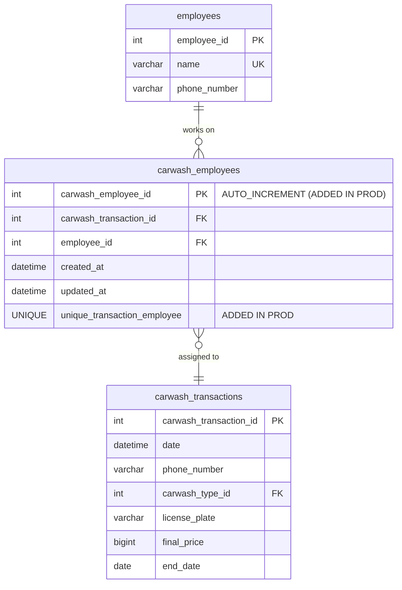

# Production Database Schema Findings

**Analysis Date:** October 22, 2025
**Source:** `db-backup-scripts/backups/kharisma_db.sql` (Production backup from October 19, 2025)
**Database:** kharisma_abadi
**Server Version:** MariaDB 10.3.39

---

## Executive Summary

After analyzing the production database backup, I found **important differences** between the reference schema (`database.sql`) and the actual production database. The production database has evolved with improvements not reflected in the base schema file.

---

## Key Findings

### 1. Production Database Metadata

```
Database: kharisma_abadi
Server: MariaDB 10.3.39 (debian-linux-gnu x86_64)
Character Set: utf8mb4
Collation: utf8mb4_general_ci
Backup Date: October 19, 2025
Total Tables: 11 (10 active + 1 backup table)
```

### 2. Critical Schema Differences

#### ⚠️ **carwash_employees Table Has Been Modified**

**Base Schema (`database.sql`):**
```sql
CREATE TABLE `carwash_employees` (
  `carwash_transaction_id` int(11) NOT NULL,
  `employee_id` int(11) NOT NULL,
  `created_at` datetime NOT NULL,
  `updated_at` datetime NOT NULL DEFAULT current_timestamp(),
  KEY `carwash_transaction_id` (`carwash_transaction_id`),
  KEY `employee_id` (`employee_id`),
  -- NO PRIMARY KEY
  -- NO UNIQUE CONSTRAINT
) ENGINE=InnoDB
```

**Production Schema (Production Database):**
```sql
CREATE TABLE `carwash_employees` (
  `carwash_employee_id` int(11) NOT NULL AUTO_INCREMENT,  -- ✅ ADDED
  `carwash_transaction_id` int(11) NOT NULL,
  `employee_id` int(11) NOT NULL,
  `created_at` datetime NOT NULL,
  `updated_at` datetime NOT NULL DEFAULT current_timestamp(),
  PRIMARY KEY (`carwash_employee_id`),  -- ✅ ADDED
  UNIQUE KEY `unique_transaction_employee` (`carwash_transaction_id`,`employee_id`),  -- ✅ ADDED
  KEY `carwash_transaction_id` (`carwash_transaction_id`),
  KEY `employee_id` (`employee_id`),
  CONSTRAINT `fk_carwash_employees_employee` FOREIGN KEY (`employee_id`)
    REFERENCES `employees` (`employee_id`)
    ON DELETE NO ACTION ON UPDATE NO ACTION,
  CONSTRAINT `fk_carwash_employees_transaction` FOREIGN KEY (`carwash_transaction_id`)
    REFERENCES `carwash_transactions` (`carwash_transaction_id`)
    ON DELETE CASCADE ON UPDATE CASCADE
) ENGINE=InnoDB AUTO_INCREMENT=67014
```

**Changes Made:**
1. ✅ **Added `carwash_employee_id` primary key** (AUTO_INCREMENT)
2. ✅ **Added UNIQUE constraint** on `(carwash_transaction_id, employee_id)` - prevents duplicate assignments
3. ✅ **Named foreign key constraints** (better for database management)
4. ✅ **67,014 records** in production (shows heavy usage)

**Impact:**
- **CRITICAL:** This is a production schema evolution not documented
- The base `database.sql` file is **outdated** and should not be used for production
- Any rebuild must use the production schema structure
- This prevents duplicate employee assignments to the same transaction

---

### 3. Additional Tables Found

#### Backup Table (Temporary)

```sql
CREATE TABLE `carwash_employees_backup_20251008_081837`
```

**Purpose:** Appears to be a backup created on October 8, 2025, at 08:18:37
- Likely created during a schema migration or data correction
- Should be reviewed and potentially dropped if no longer needed
- Takes up storage space

---

### 4. Database Objects Inventory

**Stored Procedures:** None found ❌
**Functions:** None found ❌
**Triggers:** None found ❌
**Views:** None found ❌
**Events:** None found ❌

**Conclusion:** The database relies purely on application logic with no database-level business logic.

---

### 5. Data Volume Insights

**Estimated Records (from AUTO_INCREMENT values):**

Based on the backup file analysis:
- `carwash_employees`: **67,014 records** (AUTO_INCREMENT=67014)
- `INSERT INTO` statements: **21 found** (likely small reference tables)

**Note:** The backup includes `LOCK TABLES` and `DISABLE KEYS` for performance during restore.

---

### 6. Foreign Key Constraints

**Production has named constraints (better practice):**

| Table | Constraint Name | Type |
|-------|----------------|------|
| carwash_employees | `fk_carwash_employees_employee` | FK to employees |
| carwash_employees | `fk_carwash_employees_transaction` | FK to carwash_transactions |
| carwash_transactions | `carwash_type_id` | FK to carwash_types |
| drinking_water_transactions | `drinking_water_customer_id` | FK to drinking_water_customers |
| drinking_water_transactions | `drinking_water_type_id` | FK to drinking_water_types |

**Base schema has unnamed FK constraints** - Production is better maintained.

---

## Recommendations

### Immediate Actions

1. **✅ Update Base Schema File**
   - Replace `be-kharisma-abadi/database.sql` with production schema
   - Extract from backup: `db-backup-scripts/backups/kharisma_db.sql`
   - Document the change

2. **✅ Review Backup Table**
   ```sql
   -- Check if this backup table is still needed
   SELECT COUNT(*) FROM carwash_employees_backup_20251008_081837;
   -- If not needed, drop it to free space
   DROP TABLE IF EXISTS carwash_employees_backup_20251008_081837;
   ```

3. **✅ Document Schema Evolution**
   - Create a changelog for schema changes
   - Track when `carwash_employee_id` was added
   - Document the unique constraint addition

4. **✅ Verify ORM Models Match Production**
   - Backend model files must match production schema
   - Ensure `carwash_employee_id` is used in model layer
   - Update any hardcoded queries

### Medium-Term Actions

5. **✅ Implement Database Migrations**
   - Use Alembic or similar for schema versioning
   - Prevent schema drift between environments
   - Track all future changes

6. **✅ Add Database Documentation**
   - Document the reason for the unique constraint
   - Explain the primary key addition
   - Create ER diagrams with production schema

7. **✅ Review Other Junction Tables**
   - Check if `laundry_items` needs similar improvements
   - Consider adding primary keys to all junction tables
   - Add unique constraints where appropriate

---

## Schema Comparison Matrix

| Aspect | Base Schema (database.sql) | Production Schema | Status |
|--------|---------------------------|-------------------|---------|
| **carwash_employees PK** | ❌ None | ✅ carwash_employee_id | Production Better |
| **Unique Constraint** | ❌ None | ✅ unique_transaction_employee | Production Better |
| **Named FK Constraints** | ❌ Generic names | ✅ Descriptive names | Production Better |
| **Backup Tables** | ❌ None | ⚠️ 1 backup table | Needs Cleanup |
| **Stored Procedures** | ❌ None | ❌ None | Same |
| **Triggers** | ❌ None | ❌ None | Same |
| **Views** | ❌ None | ❌ None | Same |

---

## Impact on Rebuild/Modernization

### Critical Considerations

1. **Use Production Schema as Source of Truth**
   - Do NOT use `be-kharisma-abadi/database.sql`
   - Extract from `db-backup-scripts/backups/kharisma_db.sql`
   - This is the real production structure

2. **ORM Model Generation**
   - Generate models from production backup
   - Include `carwash_employee_id` field
   - Include unique constraint in model

3. **Data Migration**
   - Production has 67,000+ carwash employee assignments
   - Migration must preserve all relationships
   - Test with production-like data volumes

4. **API Compatibility**
   - Check if API responses include `carwash_employee_id`
   - Frontend may or may not use this field
   - Ensure backward compatibility

---

## Updated Entity-Relationship Diagram

### carwash_employees (Production Version)



---

## Production Database Health

### Strengths ✅

1. **Schema has been actively improved** (unique constraints added)
2. **Named foreign key constraints** (better than base schema)
3. **Primary keys on junction tables** (best practice)
4. **Heavy production usage** (67K+ records shows system is working)
5. **Proper backups** (backup file exists and is recent)

### Concerns ⚠️

1. **Schema drift** - Production differs from base schema file
2. **Undocumented changes** - No migration history
3. **Backup table exists** - May need cleanup
4. **No database-level logic** - All logic in application (single point of failure)

---

## Action Items for Team

### Immediate (This Week)
- [ ] Verify `carwash_employee_id` is used in backend model layer
- [ ] Check if API responses include this field
- [ ] Review and drop backup table if safe
- [ ] Update `database.sql` to match production

### Short-Term (Next 2 Weeks)
- [ ] Set up Alembic for database migrations
- [ ] Create migration for the `carwash_employees` changes
- [ ] Document when these changes were made (Git history)
- [ ] Verify other tables match between base and production

### Medium-Term (Next Month)
- [ ] Consider adding primary keys to `laundry_items` table
- [ ] Add composite unique constraints where needed
- [ ] Create database documentation with production schema
- [ ] Set up schema validation in CI/CD

---

## Conclusion

The **production database schema is more mature** than the base `database.sql` file suggests. The addition of the primary key and unique constraint on `carwash_employees` shows that the team has been improving the schema in production.

**Critical Finding:** Any rebuild or modernization effort **MUST use the production schema**, not the base schema file. The production database has evolved and represents the true system architecture.

**Recommendation:** Extract the production schema, document it, and use it as the foundation for all future development and rebuild efforts.

---

**Next Steps:** Update the main analysis report (`current-app-analysis.md`) to reflect these production schema findings.
