# Component Architecture

**Project:** Kharisma Abadi v2
**Focus:** Backend component structure and organization

---

## Backend Component Breakdown

```mermaid
graph TB
    subgraph "API Layer (Handlers)"
        AuthHandler[Auth Endpoints<br/>Login, Register, Refresh]
        OrderHandler[Order Endpoints<br/>Create, Update, List]
        PaymentHandler[Payment Endpoints<br/>Process, Refund]
        CustomerHandler[Customer Endpoints<br/>CRUD operations]
        ReportHandler[Report Endpoints<br/>Sales, Service reports]
    end

    subgraph "Service Layer"
        AuthService[Authentication Service<br/>Token generation, validation]
        OrderService[Order Service<br/>Business logic]
        PaymentService[Payment Service<br/>Payment processing]
        NotificationService[Notification Service<br/>SMS, alerts]
        ReportService[Report Service<br/>Aggregations]
    end

    subgraph "Domain Layer"
        OrderEntity[Order Entity]
        CustomerEntity[Customer Entity]
        UserEntity[User Entity]
        PricingService[Pricing Service<br/>Domain Service]
        ValidationRules[Business Rules<br/>Validations]
    end

    subgraph "Repository Layer"
        OrderRepo[Order Repository]
        CustomerRepo[Customer Repository]
        UserRepo[User Repository]
        PaymentRepo[Payment Repository]
    end

    subgraph "Infrastructure"
        Database[(MariaDB)]
        SMSProvider[SMS Provider API]
        Logger[Logger]
        Config[Configuration]
    end

    AuthHandler --> AuthService
    OrderHandler --> OrderService
    PaymentHandler --> PaymentService
    CustomerHandler --> CustomerHandler
    ReportHandler --> ReportService

    OrderService --> OrderEntity
    OrderService --> PricingService
    OrderService --> OrderRepo
    OrderService --> NotificationService
    
    PaymentService --> PaymentEntity
    PaymentService --> PaymentRepo

    OrderRepo --> Database
    CustomerRepo --> Database
    UserRepo --> Database
    PaymentRepo --> Database
    
    NotificationService --> SMSProvider
    
    AuthService --> UserRepo
    
    style AuthHandler fill:#ffeb3b
    style OrderHandler fill:#ffeb3b
    style OrderService fill:#4caf50,color:#fff
    style OrderEntity fill:#2196f3,color:#fff
    style Database fill:#f44336,color:#fff
```



---

## Handler Layer

### Responsibilities
- Accept HTTP requests
- Validate input (DTOs)
- Call services/use cases
- Format responses
- Handle errors

### Example: OrderHandler

```go
// Routes
POST /api/v1/orders → CreateOrder
GET  /api/v1/orders → ListOrders
GET  /api/v1/orders/{id} → GetOrder
PATCH /api/v1/orders/{id} → UpdateOrder

// Implementation Pattern
func (h *OrderHandler) CreateOrder(c *fiber.Ctx) error {
    // 1. Parse request
    req := new(CreateOrderRequest)
    if err := c.BodyParser(req); err != nil {
        return c.Status(400).JSON(ErrorResponse{...})
    }
    
    // 2. Validate input
    if err := req.Validate(); err != nil {
        return c.Status(400).JSON(ValidationError{...})
    }
    
    // 3. Call service
    order, err := h.orderService.CreateOrder(c.Context(), req)
    if err != nil {
        return c.Status(500).JSON(ErrorResponse{...})
    }
    
    // 4. Return response
    return c.Status(201).JSON(OrderResponse{Order: order})
}
```

---

## Service Layer

### Responsibilities
- Implement business workflows
- Coordinate between entities
- Handle transactions
- Apply business rules
- Call repositories

### Example: OrderService

**Core Operations:**
- `CreateOrder(context, request)` → Order
- `UpdateOrder(context, id, request)` → Order
- `GetOrder(context, id)` → Order
- `ListOrders(context, filter)` → []Order
- `ChangeStatus(context, id, newStatus)` → Order

**Internal Logic:**
```go
func (s *OrderService) CreateOrder(ctx context.Context, req *CreateOrderRequest) (*Order, error) {
    // 1. Fetch customer
    customer, err := s.customerRepo.FindByID(ctx, req.CustomerID)
    if err != nil {
        return nil, fmt.Errorf("customer not found: %w", err)
    }

    // 2. Calculate pricing
    pricing, err := s.pricingService.CalculatePrice(
        ctx,
        req.ServiceType,
        req.Package,
    )
    if err != nil {
        return nil, fmt.Errorf("pricing calculation failed: %w", err)
    }

    // 3. Create order entity
    order := &Order{
        OrderNo:       s.generateOrderNo(),
        CustomerID:    customer.ID,
        ServiceType:   req.ServiceType,
        SubtotalPrice: pricing.BasePrice,
        TotalPrice:    pricing.TotalPrice,
        Status:        OrderPending,
    }

    // 4. Validate
    if err := order.Validate(); err != nil {
        return nil, fmt.Errorf("order validation failed: %w", err)
    }

    // 5. Persist
    if err := s.orderRepo.Save(ctx, order); err != nil {
        return nil, fmt.Errorf("failed to save order: %w", err)
    }

    // 6. Send notification
    go s.notificationService.SendOrderConfirmation(ctx, order)

    return order, nil
}
```

---

## Domain Layer

### Core Entities

**Order**
```go
type Order struct {
    ID            uint
    OrderNo       string      // Unique identifier
    CustomerID    uint        // FK to customers
    ServiceType   ServiceType // ENUM: car_wash, laundry, etc.
    Status        OrderStatus // ENUM: pending, completed, etc.
    SubtotalPrice decimal.Decimal
    DiscountAmount decimal.Decimal
    TotalPrice    decimal.Decimal
    CreatedAt     time.Time
    UpdatedAt     time.Time
}
```

**Customer**
```go
type Customer struct {
    ID              uint
    Name            string
    Phone           string
    Email           string
    CustomerType    CustomerType // ENUM: regular, vip, corporate
    MembershipNo    string
    DiscountPercent decimal.Decimal
    CreatedAt       time.Time
}
```

**User**
```go
type User struct {
    ID           uint
    Username     string
    Email        string
    PasswordHash string
    FullName     string
    Role         UserRole // ENUM: admin, manager, cashier, staff
    IsActive     bool
    CreatedAt    time.Time
}
```

### Business Rules

**Order Pricing Rules**
- Base price determined by service type and package
- Discounts applied to subtotal
- Tax calculated on subtotal - discount
- Total = subtotal - discount + tax

**Order Status Transitions**
- Pending → InProgress / Cancelled
- InProgress → QualityCheck / Cancelled
- QualityCheck → Completed / InProgress
- Completed → AwaitingPayment
- AwaitingPayment → Paid / Cancelled
- Paid → Closed

**Customer Type Assignment**
- Regular: < 20 orders
- VIP: ≥ 20 orders or membership
- Corporate: Company email domain

---

## Repository Layer

### Pattern Implementation

```go
// Interface (Domain)
type OrderRepository interface {
    Save(ctx context.Context, order *Order) error
    FindByID(ctx context.Context, id uint) (*Order, error)
    FindByOrderNo(ctx context.Context, orderNo string) (*Order, error)
    FindByCustomer(ctx context.Context, customerID uint, limit, offset int) ([]*Order, error)
    Update(ctx context.Context, order *Order) error
    Delete(ctx context.Context, id uint) error
}

// Implementation (Infrastructure - GORM)
type orderRepository struct {
    db *gorm.DB
}

func (r *orderRepository) Save(ctx context.Context, order *Order) error {
    return r.db.WithContext(ctx).Create(order).Error
}

func (r *orderRepository) FindByID(ctx context.Context, id uint) (*Order, error) {
    var order Order
    err := r.db.WithContext(ctx).
        Preload("Customer").
        Preload("Payments").
        First(&order, id).
        Error
    return &order, err
}

func (r *orderRepository) FindByCustomer(
    ctx context.Context,
    customerID uint,
    limit, offset int,
) ([]*Order, error) {
    var orders []*Order
    err := r.db.WithContext(ctx).
        Where("customer_id = ?", customerID).
        Limit(limit).
        Offset(offset).
        Order("created_at DESC").
        Find(&orders).
        Error
    return orders, err
}
```

---

## Middleware Layer

### Key Middleware Components

**1. Authentication Middleware**
```go
func AuthMiddleware(c *fiber.Ctx) error {
    authHeader := c.Get("Authorization")
    if authHeader == "" {
        return c.Status(401).JSON(ErrorResponse{
            Code:    "UNAUTHORIZED",
            Message: "Missing authorization header",
        })
    }

    // Extract token and validate
    token := strings.TrimPrefix(authHeader, "Bearer ")
    claims, err := validateToken(token)
    if err != nil {
        return c.Status(401).JSON(ErrorResponse{...})
    }

    // Store user in context
    c.Locals("userID", claims.UserID)
    c.Locals("userRole", claims.Role)

    return c.Next()
}
```

**2. Error Handler Middleware**
```go
func ErrorHandlerMiddleware(c *fiber.Ctx) error {
    err := c.Next()
    if err == nil {
        return nil
    }

    // Determine status code
    code := fiber.StatusInternalServerError
    if fe, ok := err.(*fiber.Error); ok {
        code = fe.Code
    }

    return c.Status(code).JSON(ErrorResponse{
        Code:    "ERROR",
        Message: err.Error(),
    })
}
```

**3. Logging Middleware**
```go
func LoggingMiddleware(c *fiber.Ctx) error {
    start := time.Now()
    
    err := c.Next()
    
    duration := time.Since(start)
    
    log.Info("HTTP Request",
        "method", c.Method(),
        "path", c.Path(),
        "status", c.Response().StatusCode(),
        "duration_ms", duration.Milliseconds(),
    )
    
    return err
}
```

---

## Data Flow Within Components

### Creating an Order

```
Client Request
    ↓
OrderHandler.CreateOrder()
    ├─ Parse request → CreateOrderRequest DTO
    ├─ Validate DTO
    └─ Call orderService.CreateOrder()
    
orderService.CreateOrder()
    ├─ Fetch customer from customerRepo
    ├─ Call pricingService.CalculatePrice()
    ├─ Create Order entity
    ├─ Validate business rules
    ├─ Call orderRepo.Save()
    ├─ Send notification (async)
    └─ Return Order
    
orderRepo.Save()
    ├─ Map Order to database model
    ├─ Execute INSERT query (GORM)
    └─ Return saved Order with ID

OrderHandler Response
    └─ Format OrderResponse
    └─ Set HTTP 201
    └─ Return JSON
```

---

## Component Dependencies

| Component | Depends On |
|-----------|-----------|
| OrderHandler | OrderService, OrderUseCase |
| OrderService | OrderRepo, CustomerRepo, PricingService |
| OrderRepo | GORM, Database |
| Order Entity | Nothing (pure domain) |
| PricingService | Nothing (pure domain logic) |

---

## Performance Considerations

### Query Optimization
- Use Preload for related data
- Limit result sets
- Add appropriate indexes
- Avoid N+1 queries

### Caching Strategy
- Cache customer data (rarely changes)
- Cache pricing rules (updated daily)
- Cache user roles (session-based)

### Asynchronous Operations
- Send notifications async (goroutines)
- Generate reports asynchronously
- Process bulk operations in background

---

**This component architecture ensures clean separation, testability, and maintainability of business logic.**
