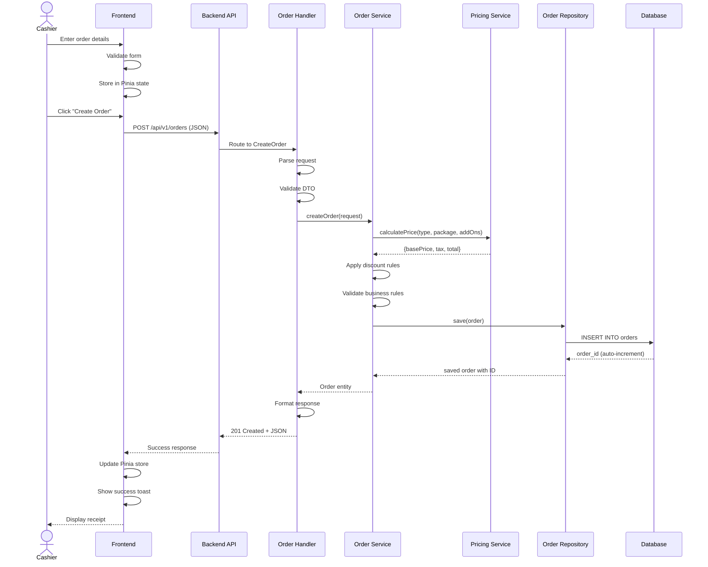
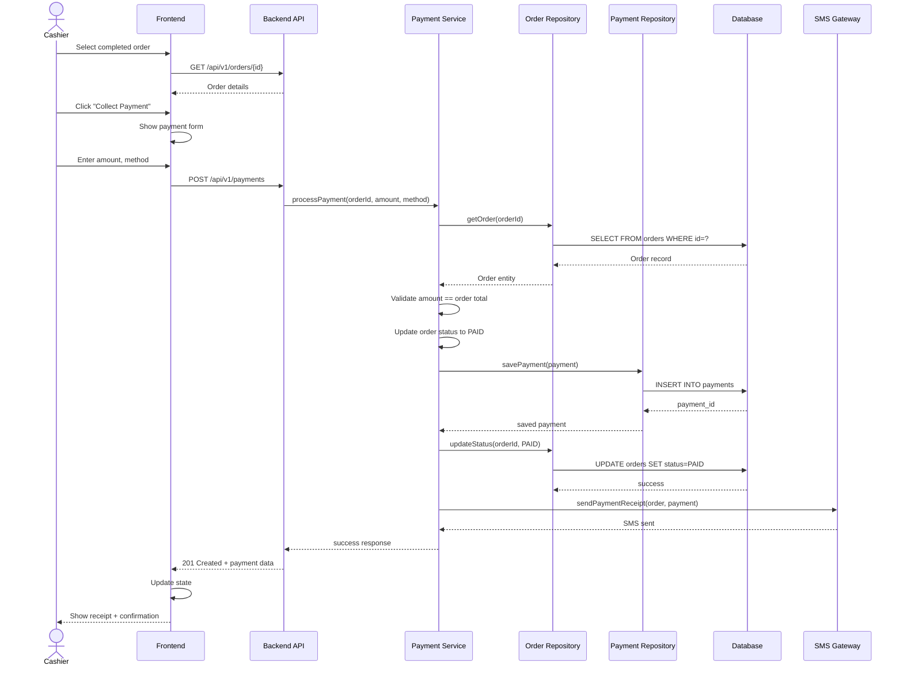
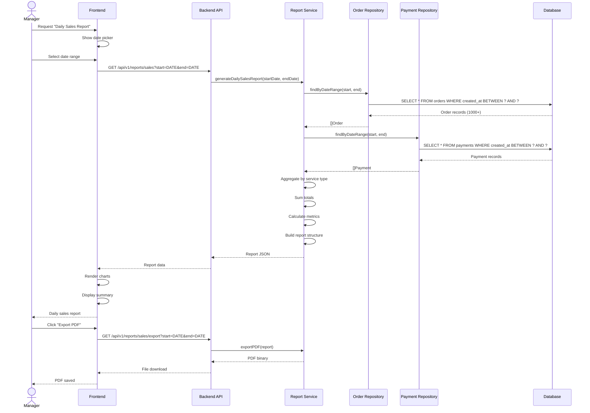
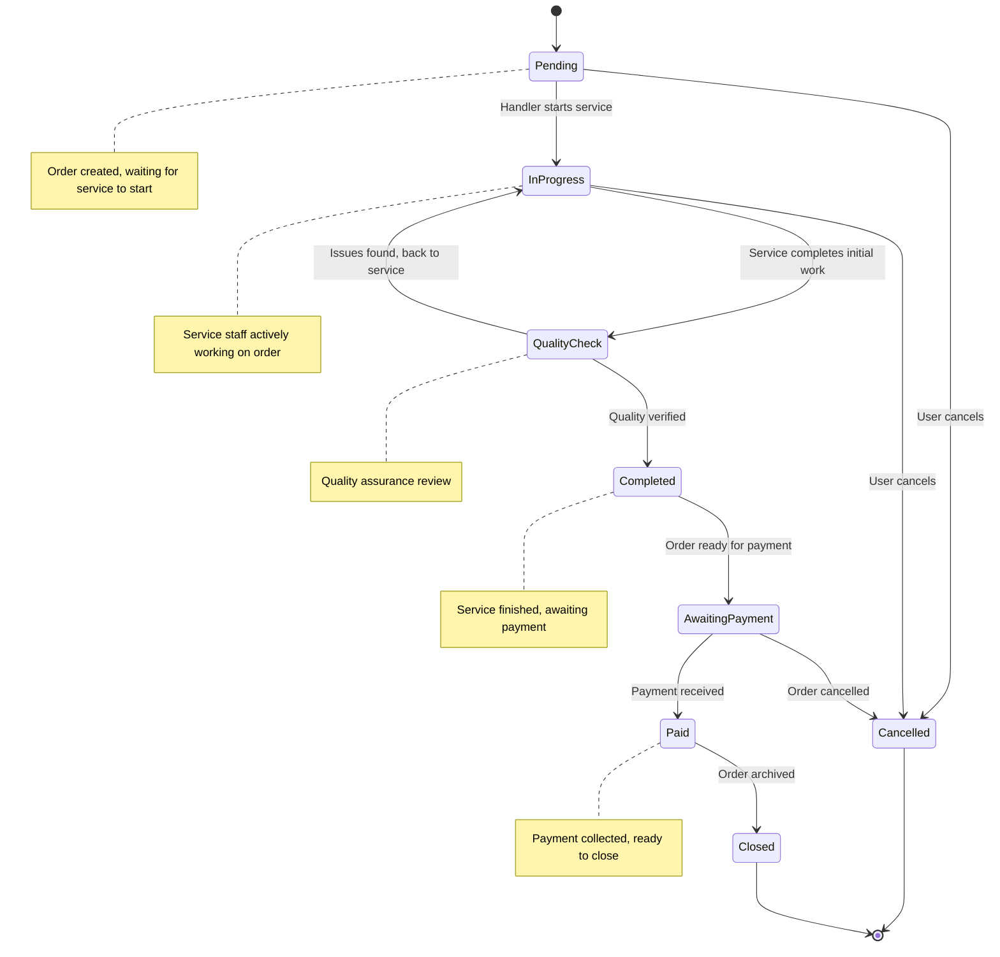
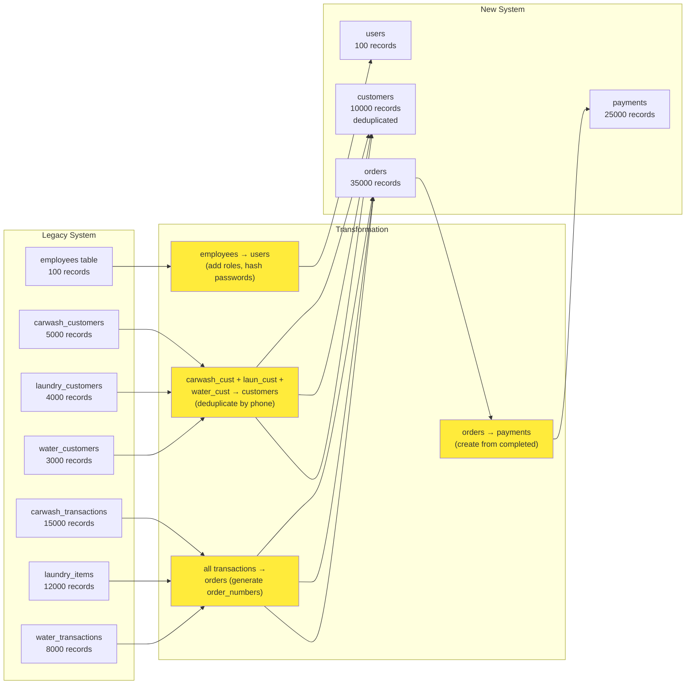
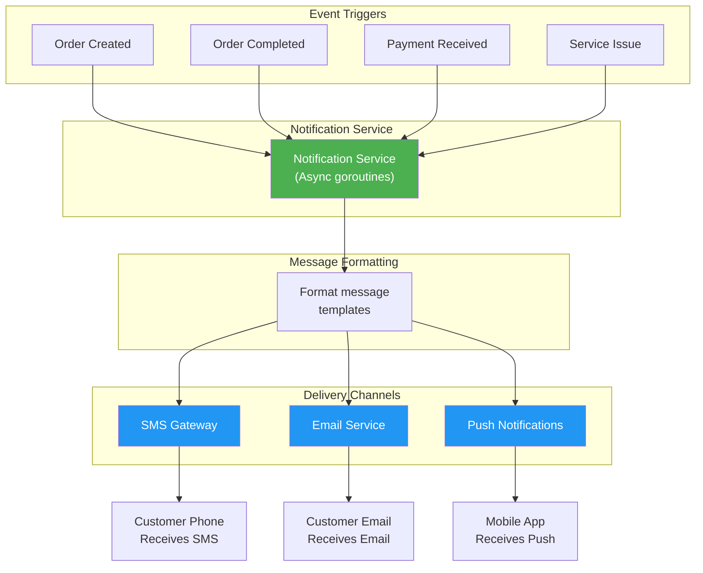
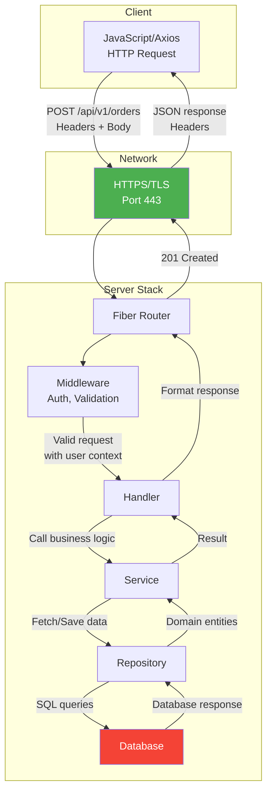
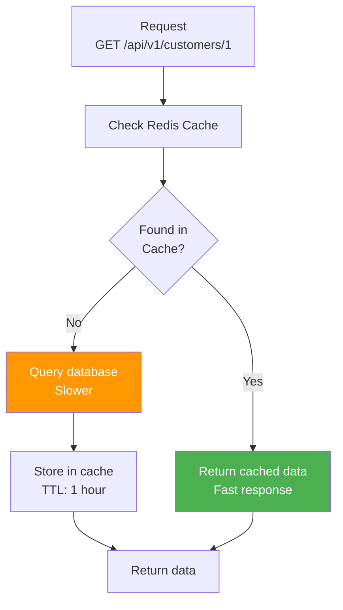
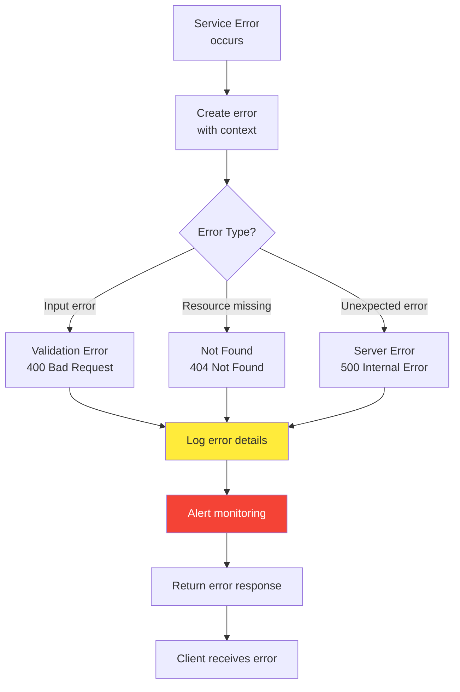

# Data Flow Diagrams

**Project:** Kharisma Abadi v2
**Focus:** How data flows through key system operations

---

## Create Car Wash Order - Sequence Diagram

---

## Payment Processing - Sequence Diagram

---

## Report Generation - Data Aggregation

---

## Update Order Status - State Machine

---

## Data Transformation: Legacy to New Schema

---

## Notification Flow

---

## API Request/Response Flow

---

## Cache Strategy

---

## Error Handling Flow

---

**These data flow diagrams illustrate how data moves through the Kharisma Abadi system for key operations.**
