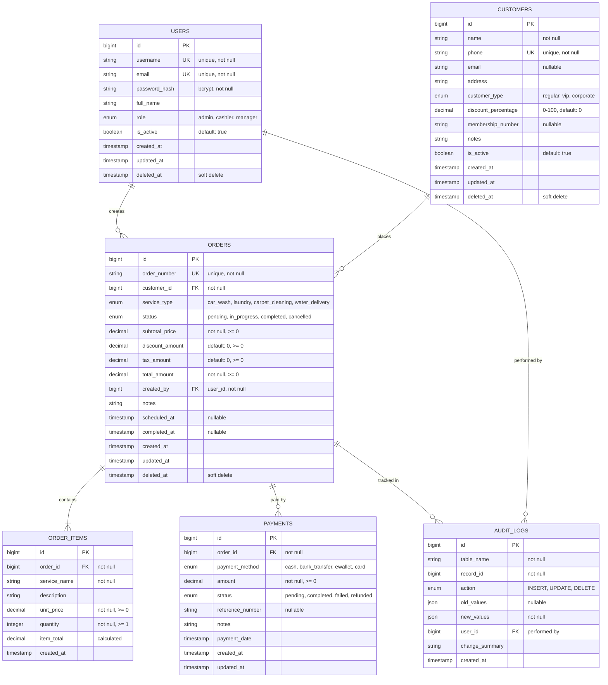

# Database Entity Relationship Diagram

**Database Schema Visualization**

The Kharisma Abadi v2 application uses a normalized relational schema designed for GORM ORM integration with MariaDB 11 LTS.

---

## Overall Entity Relationship Diagram



---

## Entity Descriptions

### USERS Table

**Purpose:** Store system users (administrators, cashiers, managers)

**Attributes:**

| Column | Type | Constraints | Purpose |
|--------|------|-----------|---------|
| id | BIGINT | PRIMARY KEY, AUTO_INCREMENT | Unique user identifier |
| username | VARCHAR(100) | UNIQUE, NOT NULL | Login identifier |
| email | VARCHAR(255) | UNIQUE, NOT NULL | User email address |
| password_hash | VARCHAR(255) | NOT NULL | Bcrypt hashed password (12 rounds) |
| full_name | VARCHAR(255) | | User's display name |
| role | ENUM | {admin, cashier, manager} | Authorization role |
| is_active | BOOLEAN | DEFAULT true | Soft activation flag |
| created_at | TIMESTAMP | DEFAULT CURRENT_TIMESTAMP | Record creation time |
| updated_at | TIMESTAMP | ON UPDATE CURRENT_TIMESTAMP | Last update time |
| deleted_at | TIMESTAMP | NULLABLE | Soft delete timestamp |

**Indexes:**
- PRIMARY KEY (id)
- UNIQUE KEY (username)
- UNIQUE KEY (email)
- INDEX (created_at)

**Business Rules:**
- Username and email must be globally unique
- Role assignment determines API access and UI permissions
- At least one admin user must exist
- Passwords must be bcrypt hashed with cost factor 12
- User soft-delete preserves audit trail

---

### CUSTOMERS Table

**Purpose:** Store customer information consolidated from legacy car wash, laundry, and water delivery systems

**Attributes:**

| Column | Type | Constraints | Purpose |
|--------|------|-----------|---------|
| id | BIGINT | PRIMARY KEY, AUTO_INCREMENT | Unique customer identifier |
| name | VARCHAR(255) | NOT NULL | Customer's name |
| phone | VARCHAR(20) | UNIQUE, NOT NULL | Primary contact phone |
| email | VARCHAR(255) | NULLABLE | Customer email |
| address | TEXT | | Physical address |
| customer_type | ENUM | {regular, vip, corporate} | Customer classification |
| discount_percentage | DECIMAL(5,2) | DEFAULT 0, 0-100 | Customer loyalty discount |
| membership_number | VARCHAR(50) | NULLABLE, UNIQUE | Customer club/loyalty ID |
| notes | TEXT | | Free-form customer notes |
| is_active | BOOLEAN | DEFAULT true | Account status |
| created_at | TIMESTAMP | DEFAULT CURRENT_TIMESTAMP | Record creation time |
| updated_at | TIMESTAMP | ON UPDATE CURRENT_TIMESTAMP | Last update time |
| deleted_at | TIMESTAMP | NULLABLE | Soft delete timestamp |

**Indexes:**
- PRIMARY KEY (id)
- UNIQUE KEY (phone)
- UNIQUE KEY (membership_number)
- INDEX (customer_type)
- INDEX (created_at)

**Business Rules:**
- Phone number is globally unique (after deduplication from legacy data)
- Customer type affects available features and discount eligibility
- VIP and corporate customers get automatic discounts
- Soft-delete preserves transaction history
- Customer can be marked inactive without losing order history

---

### ORDERS Table

**Purpose:** Store all business transactions (car wash, laundry, carpet cleaning, water delivery)

**Attributes:**

| Column | Type | Constraints | Purpose |
|--------|------|-----------|---------|
| id | BIGINT | PRIMARY KEY, AUTO_INCREMENT | Unique order identifier |
| order_number | VARCHAR(50) | UNIQUE, NOT NULL | User-facing order ID (e.g., KA-2025-001234) |
| customer_id | BIGINT | FOREIGN KEY → CUSTOMERS(id) | Associated customer |
| service_type | ENUM | {car_wash, laundry, carpet_cleaning, water_delivery} | Service classification |
| status | ENUM | {pending, in_progress, completed, cancelled} | Order workflow state |
| subtotal_price | DECIMAL(10,2) | NOT NULL, >= 0 | Sum of items before tax/discount |
| discount_amount | DECIMAL(10,2) | DEFAULT 0, >= 0 | Applied discount value |
| tax_amount | DECIMAL(10,2) | DEFAULT 0, >= 0 | Calculated tax (if applicable) |
| total_amount | DECIMAL(10,2) | NOT NULL, >= 0 | Final amount (subtotal - discount + tax) |
| created_by | BIGINT | FOREIGN KEY → USERS(id) | Cashier/manager who created order |
| notes | TEXT | | Order special notes/instructions |
| scheduled_at | TIMESTAMP | NULLABLE | Scheduled completion time |
| completed_at | TIMESTAMP | NULLABLE | Actual completion time |
| created_at | TIMESTAMP | DEFAULT CURRENT_TIMESTAMP | Order creation time |
| updated_at | TIMESTAMP | ON UPDATE CURRENT_TIMESTAMP | Last update time |
| deleted_at | TIMESTAMP | NULLABLE | Soft delete timestamp |

**Indexes:**
- PRIMARY KEY (id)
- UNIQUE KEY (order_number)
- FOREIGN KEY (customer_id)
- FOREIGN KEY (created_by)
- INDEX (service_type, created_at)
- INDEX (status)
- INDEX (created_at)

**Business Rules:**
- Order number automatically generated (format: KA-YYYY-XXXXXX)
- Subtotal must equal sum of order_items
- Discount cannot exceed subtotal
- Total must equal: subtotal - discount + tax
- All prices in Indonesian Rupiah (Rp)
- Soft-delete preserves customer transaction history
- Status workflow: pending → in_progress → completed (or cancelled at any point)

---

### ORDER_ITEMS Table

**Purpose:** Store line items for each order (e.g., car wash packages, laundry items)

**Attributes:**

| Column | Type | Constraints | Purpose |
|--------|------|-----------|---------|
| id | BIGINT | PRIMARY KEY, AUTO_INCREMENT | Unique line item identifier |
| order_id | BIGINT | FOREIGN KEY → ORDERS(id) | Associated order |
| service_name | VARCHAR(255) | NOT NULL | Item name (e.g., "Premium Car Wash", "Shirt Laundry") |
| description | TEXT | | Item details/notes |
| unit_price | DECIMAL(10,2) | NOT NULL, >= 0 | Price per unit |
| quantity | INT | NOT NULL, >= 1 | Number of units |
| item_total | DECIMAL(10,2) | | Calculated: unit_price * quantity |
| created_at | TIMESTAMP | DEFAULT CURRENT_TIMESTAMP | Record creation time |

**Indexes:**
- PRIMARY KEY (id)
- FOREIGN KEY (order_id)
- INDEX (order_id)

**Business Rules:**
- Item_total calculated as: unit_price * quantity
- Quantity must be positive integer (>= 1)
- Unit_price must be non-negative
- Order_id must reference existing ORDERS record
- Items immutable after order completion

---

### PAYMENTS Table

**Purpose:** Track payment records for orders

**Attributes:**

| Column | Type | Constraints | Purpose |
|--------|------|-----------|---------|
| id | BIGINT | PRIMARY KEY, AUTO_INCREMENT | Unique payment identifier |
| order_id | BIGINT | FOREIGN KEY → ORDERS(id) | Associated order |
| payment_method | ENUM | {cash, bank_transfer, ewallet, card} | Payment type |
| amount | DECIMAL(10,2) | NOT NULL, >= 0 | Payment amount |
| status | ENUM | {pending, completed, failed, refunded} | Payment state |
| reference_number | VARCHAR(255) | NULLABLE | Bank transfer ref, card auth code, etc. |
| notes | TEXT | | Payment notes |
| payment_date | TIMESTAMP | NULLABLE | When payment was received |
| created_at | TIMESTAMP | DEFAULT CURRENT_TIMESTAMP | Record creation time |
| updated_at | TIMESTAMP | ON UPDATE CURRENT_TIMESTAMP | Last update time |

**Indexes:**
- PRIMARY KEY (id)
- FOREIGN KEY (order_id)
- INDEX (status)
- INDEX (payment_date)

**Business Rules:**
- Amount cannot exceed order total_amount
- Payment status workflow: pending → completed (or failed/refunded)
- Cash payments typically marked completed immediately
- Bank transfers tracked via reference_number
- Multiple payments allowed per order (for partial payments)
- Soft-delete not applied (payment history immutable for audit)

---

### AUDIT_LOGS Table

**Purpose:** Track all data changes for compliance and audit trail

**Attributes:**

| Column | Type | Constraints | Purpose |
|--------|------|-----------|---------|
| id | BIGINT | PRIMARY KEY, AUTO_INCREMENT | Unique audit log identifier |
| table_name | VARCHAR(100) | NOT NULL | Table where change occurred |
| record_id | BIGINT | NOT NULL | ID of changed record |
| action | ENUM | {INSERT, UPDATE, DELETE} | Type of change |
| old_values | JSON | NULLABLE | Previous values (NULL for INSERT) |
| new_values | JSON | NOT NULL | Current values (NULL for DELETE) |
| user_id | BIGINT | FOREIGN KEY → USERS(id) | User who made change |
| change_summary | VARCHAR(500) | | Human-readable change description |
| created_at | TIMESTAMP | DEFAULT CURRENT_TIMESTAMP | Change timestamp |

**Indexes:**
- PRIMARY KEY (id)
- FOREIGN KEY (user_id)
- INDEX (table_name, record_id)
- INDEX (action)
- INDEX (created_at)

**Business Rules:**
- Automatically triggered by UPDATE/INSERT/DELETE operations
- Old_values NULL for INSERT operations
- New_values NULL for DELETE operations
- User_id captures who made the change
- Immutable log (never updated/deleted)
- Kept for 7+ years for compliance

---

## Relationships

### USERS → ORDERS (One-to-Many)

**Cardinality:** One user can create many orders

**Foreign Key:** ORDERS.created_by → USERS.id

**Constraints:**
- Every order must have a creator user
- User deletion (soft) doesn't affect existing orders
- User must have cashier/manager role to create orders

---

### CUSTOMERS → ORDERS (One-to-Many)

**Cardinality:** One customer can have many orders

**Foreign Key:** ORDERS.customer_id → CUSTOMERS.id

**Constraints:**
- Every order must reference a customer
- Customer soft-deletion doesn't remove order history
- Customer aggregates show total spend across all orders

---

### ORDERS → ORDER_ITEMS (One-to-Many)

**Cardinality:** One order has many line items

**Foreign Key:** ORDER_ITEMS.order_id → ORDERS.id

**Constraints:**
- Order must have at least one item
- Cascade delete on order (items removed with order)
- Items provide detail for order totals

---

### ORDERS → PAYMENTS (One-to-Many)

**Cardinality:** One order can have multiple payment records

**Foreign Key:** PAYMENTS.order_id → ORDERS.id

**Constraints:**
- Order can have multiple partial payments
- Total payments must eventually equal order total_amount
- Payments tracked separately for accounting

---

### ORDERS → AUDIT_LOGS (One-to-Many)

**Cardinality:** One order generates many audit entries

**Implicit Relationship:** AUDIT_LOGS.table_name = 'orders' AND record_id = ORDERS.id

**Constraints:**
- Every order change logged automatically
- Audit logs never deleted

---

### USERS → AUDIT_LOGS (One-to-Many)

**Cardinality:** One user makes many audit entries

**Foreign Key:** AUDIT_LOGS.user_id → USERS.id

**Constraints:**
- Tracks who made each change
- User deletion doesn't delete audit records
- Maintains historical accountability

---

## Schema Design Notes

### Data Types

- **BIGINT:** Used for all IDs to support 67,000+ records with room for growth
- **DECIMAL(10,2):** Used for all currency/price fields to avoid floating-point precision issues
- **ENUM:** Used for fixed status/type values to ensure data consistency
- **JSON:** Used in AUDIT_LOGS for flexible old/new value storage
- **TIMESTAMP:** All timestamps use UTC with application timezone conversion

### Soft Deletes

Tables USERS, CUSTOMERS, and ORDERS support soft deletes via `deleted_at` column:

```sql
-- Soft delete
UPDATE orders SET deleted_at = NOW() WHERE id = 123;

-- Retrieve non-deleted
SELECT * FROM orders WHERE deleted_at IS NULL;

-- Retrieve all including deleted
SELECT * FROM orders;

-- Hard restore
UPDATE orders SET deleted_at = NULL WHERE id = 123;
```

**Benefits:**
- Preserves referential integrity
- Allows data recovery
- Maintains audit trail
- Required for compliance

### Indexes

Indexes optimized for common queries:

```sql
-- Fast lookups by status
SELECT * FROM orders WHERE status = 'completed';

-- Fast date range queries
SELECT * FROM orders WHERE created_at BETWEEN date1 AND date2;

-- Fast customer order history
SELECT * FROM orders WHERE customer_id = 123 AND deleted_at IS NULL;

-- Fast pagination
SELECT * FROM orders ORDER BY created_at DESC LIMIT 10 OFFSET 20;
```

### Performance Considerations

- **Index on (service_type, created_at)** for reporting queries
- **Index on (status)** for workflow queries
- **Covering indexes** where appropriate for queries
- **Avoid full table scans** in production queries

---

## GORM Mapping

The schema is designed for seamless GORM integration:

```go
type User struct {
    ID        uint64    `gorm:"primaryKey"`
    Username  string    `gorm:"uniqueIndex"`
    Email     string    `gorm:"uniqueIndex"`
    FullName  string
    Role      string    // admin, cashier, manager
    IsActive  bool      `gorm:"default:true"`
    CreatedAt time.Time
    UpdatedAt time.Time
    DeletedAt gorm.DeletedAt `gorm:"index"`
}

type Customer struct {
    ID                  uint64    `gorm:"primaryKey"`
    Name                string
    Phone               string    `gorm:"uniqueIndex"`
    Email               string
    CustomerType        string    // regular, vip, corporate
    DiscountPercentage  decimal.Decimal
    MembershipNumber    string    `gorm:"uniqueIndex"`
    IsActive            bool      `gorm:"default:true"`
    CreatedAt           time.Time
    UpdatedAt           time.Time
    DeletedAt           gorm.DeletedAt `gorm:"index"`
    
    Orders []Order `gorm:"foreignKey:CustomerID"`
}

type Order struct {
    ID             uint64    `gorm:"primaryKey"`
    OrderNumber    string    `gorm:"uniqueIndex"`
    CustomerID     uint64    `gorm:"index"`
    Customer       Customer  `gorm:"foreignKey:CustomerID"`
    ServiceType    string    // car_wash, laundry, etc.
    Status         string    // pending, completed, etc.
    SubtotalPrice  decimal.Decimal
    DiscountAmount decimal.Decimal
    TaxAmount      decimal.Decimal
    TotalAmount    decimal.Decimal
    CreatedBy      uint64    `gorm:"index"`
    CreatedByUser  User      `gorm:"foreignKey:CreatedBy"`
    CreatedAt      time.Time
    UpdatedAt      time.Time
    DeletedAt      gorm.DeletedAt `gorm:"index"`
    
    Items    []OrderItem `gorm:"foreignKey:OrderID;cascade:delete"`
    Payments []Payment   `gorm:"foreignKey:OrderID"`
}

type OrderItem struct {
    ID        uint64    `gorm:"primaryKey"`
    OrderID   uint64    `gorm:"index"`
    Order     Order     `gorm:"foreignKey:OrderID"`
    ServiceName string
    UnitPrice decimal.Decimal
    Quantity  int
    CreatedAt time.Time
}

type Payment struct {
    ID             uint64    `gorm:"primaryKey"`
    OrderID        uint64    `gorm:"index"`
    Order          Order     `gorm:"foreignKey:OrderID"`
    PaymentMethod  string    // cash, bank_transfer, etc.
    Amount         decimal.Decimal
    Status         string    // pending, completed, etc.
    ReferenceNumber string
    PaymentDate    *time.Time
    CreatedAt      time.Time
    UpdatedAt      time.Time
}

type AuditLog struct {
    ID             uint64    `gorm:"primaryKey"`
    TableName      string
    RecordID       uint64
    Action         string    // INSERT, UPDATE, DELETE
    OldValues      datatypes.JSONType
    NewValues      datatypes.JSONType
    UserID         uint64
    ChangeSummary  string
    CreatedAt      time.Time
}
```

---

## Migration Path

This schema represents the target state after complete migration from legacy system:

1. **Pre-migration:** 10+ legacy tables with redundant customer data
2. **Migration:** Data consolidated into 7 unified tables
3. **Post-migration:** GORM application uses this schema directly
4. **Maintenance:** Zero-downtime updates, audit trail maintained

---

**Database ERD documentation complete. Ready for application development using GORM ORM.**
