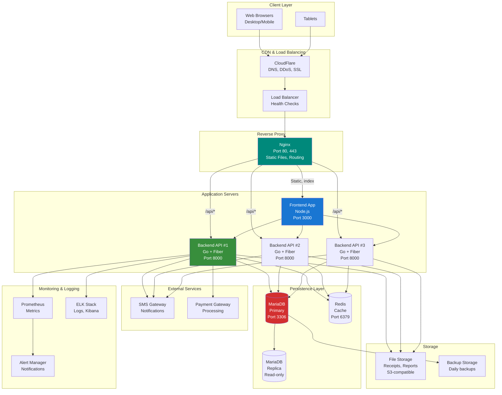

# Deployment Architecture

**Project:** Kharisma Abadi v2
**Environment:** Docker Compose (Development & Production)

---

## Production Deployment Architecture



---

## Docker Compose Setup

### Development Environment

```yaml
version: '3.8'

services:
  frontend:
    image: kharisma-frontend:latest
    container_name: kharisma-frontend
    ports:
      - "3000:3000"
    environment:
      VITE_API_URL: http://localhost:8000/api/v1
    depends_on:
      - backend
    networks:
      - kharisma-network
    volumes:
      - ./frontend:/app
    command: npm run dev

  backend:
    image: kharisma-backend:latest
    container_name: kharisma-backend
    ports:
      - "8000:8000"
    environment:
      DB_HOST: database
      DB_PORT: 3306
      DB_NAME: kharisma_db_new
      DB_USER: ${DB_USER}
      DB_PASSWORD: ${DB_PASSWORD}
      JWT_SECRET: ${JWT_SECRET}
      LOG_LEVEL: debug
    depends_on:
      database:
        condition: service_healthy
    networks:
      - kharisma-network
    volumes:
      - ./backend:/app
    command: go run ./cmd/server/main.go

  database:
    image: mariadb:11
    container_name: kharisma-database
    ports:
      - "3306:3306"
    environment:
      MYSQL_ROOT_PASSWORD: ${DB_ROOT_PASSWORD}
      MYSQL_DATABASE: kharisma_db_new
      MYSQL_USER: ${DB_USER}
      MYSQL_PASSWORD: ${DB_PASSWORD}
    healthcheck:
      test: ["CMD", "mysqladmin", "ping", "-h", "localhost"]
      timeout: 5s
      retries: 10
    networks:
      - kharisma-network
    volumes:
      - db_data:/var/lib/mysql
      - ./migrations:/docker-entrypoint-initdb.d

  redis:
    image: redis:7-alpine
    container_name: kharisma-redis
    ports:
      - "6379:6379"
    networks:
      - kharisma-network
    volumes:
      - redis_data:/data

volumes:
  db_data:
  redis_data:

networks:
  kharisma-network:
    driver: bridge
```

---

## Port Mappings

| Service | Port | Purpose |
|---------|------|---------|
| Frontend | 3000 | Vue 3 application |
| Backend | 8000 | Go + Fiber API |
| Database | 3306 | MariaDB server |
| Redis | 6379 | Cache layer |
| Nginx | 80, 443 | Reverse proxy (prod) |

---

## Network Topology

### Development
```
localhost:3000 → Frontend (port 3000)
localhost:8000 → Backend (port 8000)
localhost:3306 → Database (port 3306)

All services on same network (kharisma-network)
```

### Production
```
Client → CDN (CloudFlare)
       ↓
Load Balancer
       ↓
Nginx Reverse Proxy (ports 80, 443)
       ├─ Static files → Frontend
       └─ /api/* → Backend cluster (3+ instances)
              ↓
         Redis cache
              ↓
         MariaDB cluster (Primary + Replicas)
```

---

## Environment Configuration

### Development (.env.dev)
```bash
DB_HOST=database
DB_PORT=3306
DB_NAME=kharisma_db_new
DB_USER=kharisma
DB_PASSWORD=dev_password
DB_ROOT_PASSWORD=root_password
JWT_SECRET=dev-secret-key
LOG_LEVEL=debug
API_PORT=8000
```

### Production (.env.prod)
```bash
DB_HOST=prod-database.internal
DB_PORT=3306
DB_NAME=kharisma_db_new
DB_USER=kharisma_prod
DB_PASSWORD=${DB_PROD_PASSWORD}
JWT_SECRET=${JWT_PROD_SECRET}
LOG_LEVEL=info
API_PORT=8000
REDIS_URL=redis://prod-redis.internal:6379
```

---

## Deployment Steps

### 1. Pre-Deployment
```bash
# Build images
docker build -t kharisma-frontend:latest ./frontend
docker build -t kharisma-backend:latest ./backend

# Verify images
docker images | grep kharisma
```

### 2. Database Migration
```bash
# Run migrations
docker-compose exec database mysql -u root -p < migrations/schema/001_create_new_tables.sql
docker-compose exec database mysql -u root -p < migrations/data/001_migrate_users.sql
```

### 3. Start Services
```bash
# Development
docker-compose up -d

# Production
docker-compose -f docker-compose.yml -f docker-compose.prod.yml up -d
```

### 4. Verify Deployment
```bash
# Check service health
curl http://localhost:8000/health
curl http://localhost:3000

# Check database
docker-compose exec database mysql -u root -p -e "SELECT VERSION();"

# Check logs
docker-compose logs -f backend
```

---

## Service Health Checks

### Backend Health Endpoint
```bash
GET /health
Response:
{
  "status": "healthy",
  "uptime": 1234567,
  "database": "connected",
  "version": "1.0.0"
}
```

### Database Health
```bash
docker-compose exec database mysqladmin ping -u root -p
```

### Cache Health
```bash
docker-compose exec redis redis-cli ping
```

---

## Scaling Considerations

### Horizontal Scaling
```yaml
# Scale backend to 3 instances
docker-compose up -d --scale backend=3

# Load balancer (Nginx) automatically distributes traffic
```

### Resource Limits
```yaml
services:
  backend:
    deploy:
      resources:
        limits:
          cpus: '2'
          memory: 2G
        reservations:
          cpus: '1'
          memory: 1G
```

---

## Volume Management

| Volume | Purpose | Persistence |
|--------|---------|-------------|
| db_data | MariaDB data | Persistent |
| redis_data | Cache data | Non-persistent (can lose) |
| ./migrations | SQL migration files | Persistent |
| ./backend | Source code | Persistent |
| ./frontend | Source code | Persistent |

---

## Backup Strategy

### Daily Database Backup
```bash
#!/bin/bash
# backup.sh

TIMESTAMP=$(date +%Y%m%d_%H%M%S)
docker-compose exec database mysqldump \
  -u root -p$DB_ROOT_PASSWORD \
  kharisma_db_new \
  > backups/backup_${TIMESTAMP}.sql

# Compress
gzip backups/backup_${TIMESTAMP}.sql

# Upload to backup storage
aws s3 cp backups/backup_${TIMESTAMP}.sql.gz s3://backups/kharisma/
```

---

## Monitoring and Logging

### Log Aggregation
```bash
# View backend logs
docker-compose logs -f backend

# View database logs
docker-compose logs -f database

# View all logs
docker-compose logs -f
```

### Metrics Collection
- Prometheus scrapes metrics from `/metrics` endpoint
- Stored in time-series database
- Grafana dashboards visualize metrics
- AlertManager triggers notifications

---

## Security Considerations

✅ **Implemented in Production:**
- HTTPS/TLS encryption (Let's Encrypt)
- Network isolation (Docker networks)
- Environment variable secrets
- Non-root container users
- Read-only file systems
- Security scanning in CI/CD

⚠️ **To Implement:**
- WAF (Web Application Firewall)
- DDoS protection
- Database encryption at rest
- Key rotation policies
- Network segmentation

---

## Disaster Recovery

### RTO: Recovery Time Objective
- **Target:** < 1 hour to full service

### RPO: Recovery Point Objective
- **Target:** < 15 minutes of data loss

### Recovery Procedures
1. Restore latest backup: ~30 minutes
2. Verify data integrity: ~10 minutes
3. Start services: ~5 minutes
4. Health checks: ~5 minutes
5. User communication: ~5 minutes

---

**This deployment architecture supports development, staging, and production environments with scalability, monitoring, and disaster recovery.**
