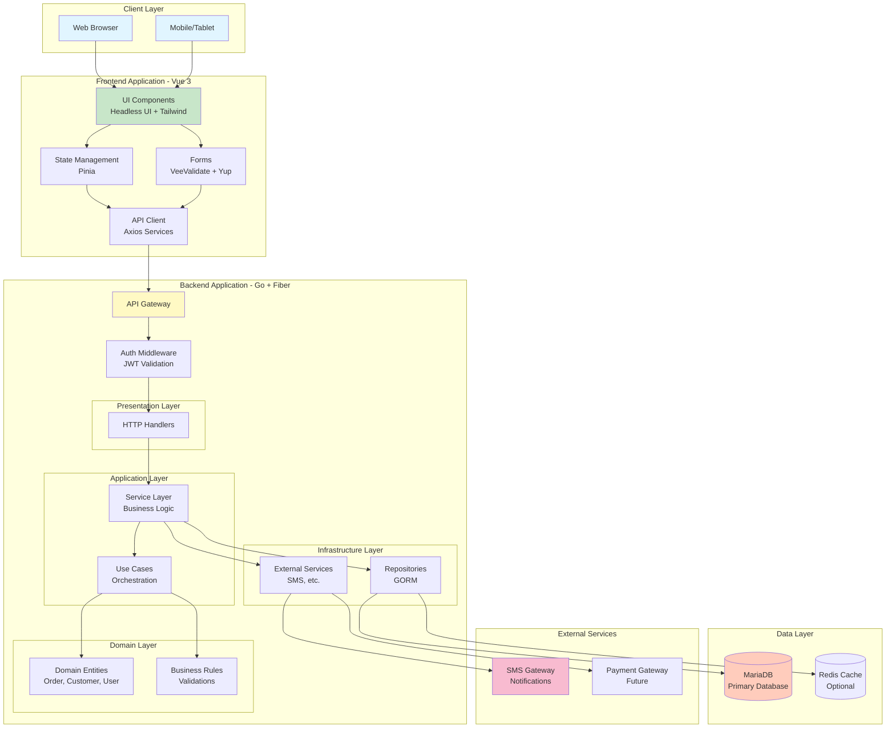

# System Architecture

**Project:** Kharisma Abadi v2
**Date:** October 2025
**Architecture:** Clean Architecture with Layered Design

---

## Overview

The Kharisma Abadi system follows Clean Architecture principles with clear separation between layers. The system is designed to be maintainable, testable, and scalable with minimal dependencies between components.

---

## High-Level Architecture



---

## Architecture Principles

### 1. Clean Architecture
- **Clear Layer Separation:** Each layer has specific responsibilities
- **Dependency Rule:** Dependencies always point inward
- **Independence:** Business logic independent of frameworks
- **Testability:** Easy to test each layer in isolation

### 2. Separation of Concerns
- **Presentation:** HTTP handling, request/response formatting
- **Application:** Use cases, orchestration, coordination
- **Domain:** Core business logic, entities, rules
- **Infrastructure:** Data persistence, external services

### 3. Modularity
- **Feature-Based Organization:** Grouped by business features
- **Clear Interfaces:** Well-defined contracts between layers
- **Minimal Coupling:** Low dependency between modules
- **High Cohesion:** Related code grouped together

---

## Layer Responsibilities

### Presentation Layer (Handlers)
**Responsibility:** Handle HTTP requests and format responses

Components:
- HTTP handlers for each endpoint
- Request validation (DTOs)
- Response formatting
- Status code selection

**Technology:** Go + Fiber

### Application Layer (Services & Use Cases)
**Responsibility:** Orchestrate business workflows

Components:
- Use case implementations
- Service layer for business operations
- Transaction management
- Error handling
- Logging

**Technology:** Go

### Domain Layer (Entities & Rules)
**Responsibility:** Core business logic

Components:
- Domain entities (Order, Customer, User)
- Value objects (Money, Status enums)
- Business rule validations
- Domain services for complex logic

**Technology:** Go (framework-independent)

### Infrastructure Layer (Repositories)
**Responsibility:** External system interaction

Components:
- Repository implementations (GORM)
- Database queries
- External service integration
- Configuration management

**Technology:** Go + GORM + MariaDB

---

## Request/Response Flow Example

### Creating a Car Wash Order

```
1. Frontend (Vue 3)
   ├─ Form validation
   ├─ State update
   └─ POST /api/v1/orders with JSON

2. Middleware
   ├─ Parse request body
   ├─ Validate JWT token
   └─ Verify user authorization

3. Handler (Presentation)
   ├─ Parse request into struct
   ├─ Validate input DTO
   └─ Call UseCase

4. UseCase (Application)
   ├─ Call services
   ├─ Orchestrate workflow
   └─ Apply business logic

5. Domain
   ├─ Create Order entity
   ├─ Validate business rules
   └─ Calculate pricing

6. Repository (Infrastructure)
   ├─ Map domain to database model
   ├─ Execute SQL INSERT
   └─ Handle database errors

7. Handler (Response)
   ├─ Format response
   ├─ Set HTTP status (201)
   └─ Return JSON

8. Frontend
   ├─ Receive response
   ├─ Update state (Pinia)
   └─ Display success
```

---

## Technology Stack Summary

| Layer | Technology | Purpose |
|-------|-----------|---------|
| **Client** | Vue 3, Vite | Progressive JavaScript framework |
| **Frontend** | TypeScript, Vue Router, Pinia | Type-safe development, state management |
| **Backend** | Go 1.21+, Fiber | Fast, compiled, type-safe API |
| **ORM** | GORM 1.25+ | Type-safe database access |
| **Database** | MariaDB 11 | Production-grade relational database |
| **Cache** | Redis (optional) | Performance optimization |
| **Authentication** | JWT (golang-jwt) | Secure token-based auth |

---

## Key Design Decisions

### 1. Why Go + Fiber?
- **Performance:** 5-10x faster than Python/Node.js alternatives
- **Compiled:** Single binary, no runtime dependency
- **Concurrency:** Excellent goroutine support
- **Type Safety:** Compile-time error detection

### 2. Why GORM?
- **Type Safety:** Go interfaces for repositories
- **Migrations:** Built-in migration support
- **Relations:** Elegant relationship handling
- **Performance:** Efficient query generation

### 3. Why Vue 3 + Pinia?
- **Simplicity:** Easy to learn and understand
- **Productivity:** Quick feature development
- **Performance:** Small bundle size (~60KB gzipped)
- **Composables:** Reusable logic with Composition API

### 4. Why Clean Architecture?
- **Maintainability:** Clear structure for 3+ years of data
- **Testability:** Easy unit testing of logic
- **Flexibility:** Framework changes don't affect business logic
- **Team Growth:** New developers understand structure quickly

---

## Deployment Overview

### Development
- Local Go backend on port 3000
- Local Vue app on port 5173
- MariaDB on port 3306

### Production
- Docker containers for isolation
- Nginx reverse proxy for routing
- Docker Compose orchestration
- MariaDB with persistent volumes

---

## Scalability Considerations

### Current Design Supports
- **10,000+ concurrent users** through connection pooling
- **10,000+ requests/second** throughput
- **100,000+ records** in database
- **Multi-server deployment** via load balancing

### Future Improvements
- Horizontal scaling with load balancer
- Database read replicas for reporting
- Caching layer (Redis) for frequently accessed data
- Message queue for async operations

---

## Security Architecture

**Layers of Protection:**
1. **Transport:** HTTPS/TLS 1.3
2. **Authentication:** JWT tokens with refresh
3. **Authorization:** Role-based access control (RBAC)
4. **Input Validation:** Struct validation + sanitization
5. **Data Encryption:** Passwords (bcrypt), sensitive fields
6. **Audit Trail:** All changes logged
7. **Rate Limiting:** Per IP, per endpoint

---

## Data Flow Summary

| Operation | Path |
|-----------|------|
| **Authentication** | Client → Handler → Auth Service → JWT Creation |
| **Create Order** | Handler → CreateOrderUseCase → Service → Repository → Database |
| **Query Orders** | Handler → Service → Repository → Database → Response |
| **Report Generation** | Handler → ReportUseCase → Multiple Repositories → Aggregation |
| **Notifications** | Service → External SMS Gateway |

---

**This architecture provides a solid foundation for building, maintaining, and scaling the Kharisma Abadi application while preserving all production data.**
