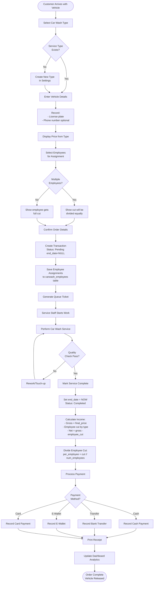
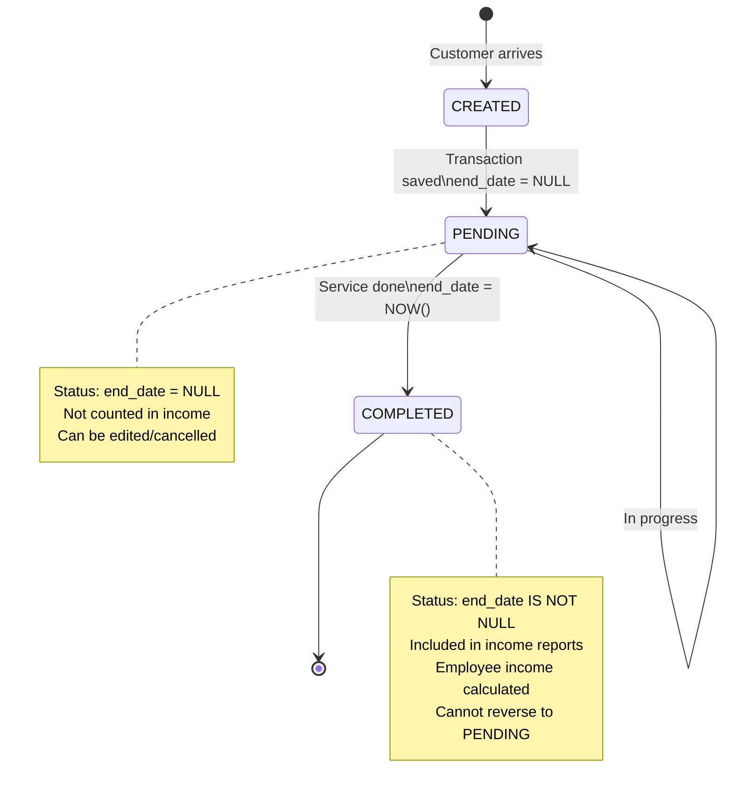

# Car Wash Service Flow

**Service Type:** Car Wash (Cuci Mobil)
**Complexity:** Medium
**Frequency:** 50-100 orders per day (estimated)
**Average Duration:** 3-5 minutes per order

---

## Overview

### Purpose
Process car wash service orders from customer arrival through service completion to payment and income distribution.

### Business Value
- Primary revenue generator
- Employee income tracking and distribution
- Configurable pricing and employee compensation
- Fast turnaround service

### User Roles Involved
- **Cashier/Front Desk Staff** - Creates orders, collects payment
- **Service Staff** - Performs car wash service
- **Customer** - Receives service

### System Components
- POS System (Frontend)
- Transaction Management API
- Employee Assignment System
- Income Calculation Engine
- Database (carwash_transactions, carwash_employees, carwash_types)

---

## Process Flow Diagram



---

## Detailed Process Steps

### Step 1: Customer Arrival & Service Selection

**User Action:** Customer drives vehicle to car wash bay, approaches cashier

**System Action:** Cashier opens car wash module

**Business Rules:**
- No authentication required (open system currently)
- Can process multiple customers simultaneously
- No appointment system (walk-in only)

**UI:** `/cuci-mobil/pekerjaan-baru`

**Validation:** None at this step

---

### Step 2: Service Type Selection

**User Action:** Cashier selects car wash service type

**System Action:** Load all car wash types from `carwash_types` table, display with prices

**Business Rules:**
- Service types defined in database (configurable)
- Each type has: name, base price, cut_type, cut_amount
- **cut_type = 1:** Employee gets fixed Rupiah amount
- **cut_type = 2:** Employee gets percentage of price

**Data Retrieved:**
```sql
SELECT carwash_type_id, name, price, cut_type, cut_amount
FROM carwash_types
ORDER BY name
```

**Example Types:**
- Cuci Mobil Sedan (Rp 50,000, cut_type=2, cut_amount=30%)
- Cuci Mobil SUV (Rp 75,000, cut_type=2, cut_amount=30%)
- Cuci Motor (Rp 20,000, cut_type=1, cut_amount=Rp 10,000)

**API:** `GET /api/carwash-type/`

**Validation:**
- At least one service type must exist
- If none exist, redirect to settings to create type

---

### Step 3: Vehicle Information Entry

**User Action:** Cashier enters vehicle details

**System Action:** Display form fields

**Fields:**
- **License Plate** (required, max 12 chars) - e.g., "B 1234 XYZ"
- **Phone Number** (optional, max 18 chars) - Customer contact
- **Date** (auto-filled with current date/time)

**Business Rules:**
- License plate required for tracking
- Phone number optional but recommended
- Date/time auto-recorded (not editable)

**Validation:**
- License plate: required, max 12 characters
- Phone number: optional, format validation if provided

---

### Step 4: Price Display

**User Action:** Review displayed price

**System Action:** Show final price from selected service type

**Business Rules:**
- Price pulled directly from service type (no manual override in current system)
- **final_price = carwash_type.price**
- No discount mechanism (flat pricing)

**Formula:**
```
final_price = carwash_type.price
```

**Note:** Current system does not support:
- Dynamic pricing (time-based, demand-based)
- Discounts or promotional codes
- Membership pricing

**Recommendation:** Consider adding pricing adjustments in future

---

### Step 5: Employee Selection & Assignment

**User Action:** Cashier selects one or more employees to work on this job

**System Action:** Display all active employees, allow multi-select

**Business Rules:**
- Can assign 1 to N employees
- Each employee can only be assigned ONCE per transaction (unique constraint)
- Employee income calculated and divided at completion

**Data Retrieved:**
```sql
SELECT employee_id, name, phone_number
FROM employees
ORDER BY name
```

**Employee Cut Preview:**
```
IF cut_type = 1:
    total_employee_cut = cut_amount (fixed Rupiah)
ELSE IF cut_type = 2:
    total_employee_cut = final_price × (cut_amount / 100)

per_employee_income = total_employee_cut // num_selected_employees
```

**Example:**
- Service: Cuci Mobil Sedan (Rp 50,000, 30% cut)
- Employees selected: 2 (Ahmad, Budi)
- Total cut: Rp 15,000
- Per employee: Rp 15,000 // 2 = Rp 7,500 each

**API:** `GET /api/employee/`

**Validation:**
- At least one employee must be selected
- No duplicate employee in same transaction
- Employee must exist in database

---

### Step 6: Order Confirmation

**User Action:** Review all order details, confirm

**System Action:** Display summary for confirmation

**Summary Includes:**
- Service type and price
- Vehicle license plate
- Assigned employees
- Employee cut (total and per employee)
- Business net income
- Date/time

**Calculation Preview:**
```
Gross Income:    Rp 50,000 (final_price)
Employee Cut:    Rp 15,000 (30% × Rp 50,000)
Net Income:      Rp 35,000 (Rp 50,000 - Rp 15,000)

Employees: Ahmad, Budi (2 employees)
Per Employee: Rp 7,500
```

---

### Step 7: Transaction Creation

**User Action:** Click "Create Order" button

**System Action:** Insert transaction and employee assignments into database

**API:** `POST /api/carwash-transaction/`

**Request Body:**
```json
{
  "date": "2025-10-22 10:30:00",
  "phone_number": "08123456789",
  "carwash_type_id": 1,
  "license_plate": "B 1234 XYZ",
  "final_price": 50000,
  "employee": [1, 2]
}
```

**Database Operations:**
```sql
-- 1. Insert transaction
INSERT INTO carwash_transactions (
    date, phone_number, carwash_type_id,
    license_plate, final_price, end_date,
    created_at, updated_at
) VALUES (
    '2025-10-22 10:30:00', '08123456789', 1,
    'B 1234 XYZ', 50000, NULL,
    NOW(), NOW()
);

-- 2. Get inserted transaction_id
SET @transaction_id = LAST_INSERT_ID();

-- 3. Insert employee assignments
INSERT INTO carwash_employees (carwash_transaction_id, employee_id, created_at, updated_at)
VALUES (@transaction_id, 1, NOW(), NOW()),
       (@transaction_id, 2, NOW(), NOW());
```

**State Transition:**
- **NULL → PENDING**
- `end_date = NULL` means transaction is pending/in-progress
- Not counted in income calculations yet

**Response:**
```json
{
  "carwash_transaction_id": 123,
  "message": "Transaction created successfully"
}
```

---

### Step 8: Service Execution

**User Action:** Service staff performs car wash

**System Action:** None (manual service)

**Process:**
1. Service staff receives vehicle
2. Performs washing according to service type
3. Quality checks during service
4. Prepares vehicle for customer pickup

**Duration:** Varies by service type
- Motorcycle: 10-15 minutes
- Sedan: 20-30 minutes
- SUV: 30-45 minutes

**Business Rules:**
- No time tracking in current system
- No status updates during service
- Staff manually tracks queue

**State:** Still PENDING (end_date = NULL)

---

### Step 9: Service Completion

**User Action:** Cashier or service staff marks service as complete

**System Action:** Set `end_date` to current date

**API:** `PUT /api/carwash-transaction/end-date/{id}/`

**Request Body:**
```json
{
  "end_date": "2025-10-22"
}
```

**Database Operation:**
```sql
UPDATE carwash_transactions
SET end_date = '2025-10-22',
    updated_at = NOW()
WHERE carwash_transaction_id = 123;
```

**State Transition:**
- **PENDING → COMPLETED**
- `end_date IS NOT NULL` means transaction is completed
- **NOW counted in income calculations**

**Business Rules Applied:**
- **TX-WF-001:** Transaction completion via end_date
- Once set, transaction included in:
  - Dashboard income totals
  - Employee income reports
  - Revenue analytics

---

### Step 10: Income Calculation

**System Action:** Calculate income distribution (triggered by end_date being set)

**Business Rules Applied:**
- **CW-INC-001:** Variable employee cut calculation
- **CW-INC-002:** Multi-employee income distribution

**Calculation Process:**

```python
# Step 1: Retrieve service type configuration
carwash_type = get_carwash_type(transaction.carwash_type_id)
cut_type = carwash_type.cut_type
cut_amount = carwash_type.cut_amount

# Step 2: Calculate total employee cut
if cut_type == 1:  # Fixed amount
    total_employee_cut = cut_amount
elif cut_type == 2:  # Percentage
    total_employee_cut = transaction.final_price * (cut_amount / 100)

# Step 3: Calculate business income
gross_income = transaction.final_price
net_income = gross_income - total_employee_cut

# Step 4: Divide cut among employees (floor division)
num_employees = count_employees(transaction.carwash_transaction_id)
per_employee_income = total_employee_cut // num_employees

# Note: Remainder is lost (precision issue)
# Example: Rp 50,000 ÷ 3 = Rp 16,666 each (Rp 2 lost)
```

**Example Calculation:**

**Service:** Sedan Wash (Rp 50,000, 30% cut)
**Employees:** Ahmad, Budi (2 employees)

```
Gross Income:        Rp 50,000
Employee Cut (30%):  Rp 15,000
Net Income:          Rp 35,000

Per Employee:        Rp 15,000 // 2 = Rp 7,500
```

**Income Distribution:**
- **Business:** Rp 35,000 (70%)
- **Ahmad:** Rp 7,500
- **Budi:** Rp 7,500

---

### Step 11: Payment Processing

**User Action:** Collect payment from customer

**System Action:** Record payment details

**Payment Methods:**
- **Cash** - Immediate payment
- **Bank Transfer** - Transfer to business account
- **E-Wallet** (OVO, GoPay, Dana)
- **Credit/Debit Card**

**Business Rules:**
- Payment required before vehicle release
- Full payment only (no partial payments in current system)
- Payment method not tracked in database (future enhancement)

**Note:** Current system doesn't have dedicated payment tracking table

**Recommendation:** Add payment status tracking
- UNPAID, PARTIALLY_PAID, PAID
- Payment method field
- Payment timestamp

---

### Step 12: Receipt Generation

**User Action:** Print receipt for customer

**System Action:** Generate and print receipt

**Receipt Contents:**
- Business name: "Kharisma Abadi"
- Transaction ID
- Date and time
- Service type
- License plate
- Price
- Payment method (if tracked)
- Employee names (optional)

**Technology:** `react-to-print` library

---

### Step 13: Dashboard Update

**System Action:** Transaction now appears in dashboard analytics

**Automatic Updates:**
- Today's income (+Rp 50,000 gross, +Rp 35,000 net)
- This month's income
- This year's income
- All-time income
- Employee income reports (Ahmad +Rp 7,500, Budi +Rp 7,500)

**API Endpoints Affected:**
- `GET /api/dashboard/income/`
- `GET /api/dashboard/today-income/`
- `GET /api/employee-income/`

---

## State Diagram



---

## Integration Points

### Database Tables

**Primary Table:** `carwash_transactions`
```sql
carwash_transaction_id (PK)
date (DATETIME)
phone_number (VARCHAR, nullable)
carwash_type_id (FK -> carwash_types)
license_plate (VARCHAR)
final_price (BIGINT)
end_date (DATE, nullable)
created_at (DATETIME)
updated_at (DATETIME)
```

**Junction Table:** `carwash_employees`
```sql
carwash_transaction_id (FK -> carwash_transactions)
employee_id (FK -> employees)
created_at (DATETIME)
updated_at (DATETIME)
```

**Reference Table:** `carwash_types`
```sql
carwash_type_id (PK)
name (VARCHAR)
price (BIGINT)
cut_type (INT) -- 1=fixed, 2=percentage
cut_amount (FLOAT)
created_at (DATETIME)
updated_at (DATETIME)
```

**Reference Table:** `employees`
```sql
employee_id (PK)
name (VARCHAR, UNIQUE)
phone_number (VARCHAR, nullable)
created_at (DATETIME)
updated_at (DATETIME)
```

### API Endpoints Used

| Endpoint | Method | Purpose |
|----------|--------|---------|
| `/api/carwash-type/` | GET | List all car wash types |
| `/api/employee/` | GET | List all employees |
| `/api/carwash-transaction/` | POST | Create new transaction |
| `/api/carwash-transaction/{id}/` | PUT | Update transaction |
| `/api/carwash-transaction/end-date/{id}/` | PUT | Mark as completed |
| `/api/dashboard/income/` | GET | View updated income |

---

## Business Rules Summary

### Pricing Rules

**BR-CW-001:** Service price determined by car wash type
- Fixed price per service type
- No dynamic pricing
- No discounts in current system

**BR-CW-002:** Employee cut is configurable per service type
- cut_type = 1: Fixed Rupiah amount
- cut_type = 2: Percentage of price

### Employee Rules

**BR-CW-003:** Multiple employees can work on one job
- Unique assignment (no duplicates)
- Income divided equally among all assigned employees
- Floor division used (may lose fractional Rupiah)

**BR-CW-004:** Employee income tracked only for completed jobs
- Pending jobs (end_date = NULL) not counted
- Completed jobs (end_date IS NOT NULL) counted

### Transaction Rules

**BR-CW-005:** Transaction completion tracked via end_date
- NULL = Pending/In Progress
- NOT NULL = Completed

**BR-CW-006:** Only completed transactions counted in income
- Dashboard income calculations
- Employee income reports

---

## Error Handling

### Common Errors

| Error | Cause | Resolution |
|-------|-------|------------|
| Service type not found | Type deleted or not created | Create service type in settings |
| No employees available | No employees in database | Add employees in settings |
| Duplicate employee assignment | Employee selected twice | System prevents via unique constraint |
| Transaction not found | Invalid transaction ID | Check transaction exists |
| Cannot set end_date | Transaction already completed | Display error, prevent re-completion |

### Validation Errors

| Field | Validation | Error Message |
|-------|------------|---------------|
| License Plate | Required, max 12 chars | "License plate is required" |
| Phone Number | Optional, max 18 chars | "Invalid phone number format" |
| Service Type | Must exist in database | "Service type not found" |
| Employees | At least one required | "Please select at least one employee" |
| Final Price | Must be > 0 | "Price must be greater than 0" |

---

## Performance Considerations

### Query Optimization

**Current Optimizations:**
- JOIN queries to fetch employee data with transactions
- Bulk employee fetching to avoid N+1 queries
- Indexed foreign keys (carwash_type_id, employee_id)

**Recommended Indexes:**
```sql
CREATE INDEX idx_carwash_date ON carwash_transactions(date);
CREATE INDEX idx_carwash_end_date ON carwash_transactions(end_date);
CREATE INDEX idx_carwash_license_plate ON carwash_transactions(license_plate);
```

### Expected Load

- **Peak Hours:** 8-10 AM, 5-7 PM
- **Concurrent Users:** 2-3 cashiers
- **Transactions per Hour:** 10-20 during peak
- **Average Order Processing:** 3-5 minutes

---

## Known Issues & Limitations

### Issue 1: Floor Division Precision Loss

**Problem:** Employee income division loses fractional Rupiah

**Example:**
```
Total Cut: Rp 50,000
Employees: 3
Per Employee: Rp 50,000 // 3 = Rp 16,666
Total Distributed: Rp 16,666 × 3 = Rp 49,998
Lost: Rp 2
```

**Impact:** Micro-losses accumulate over time

**Recommendation:**
- Use precise division and round
- Give remainder to first employee
- Track and document rounding policy

### Issue 2: No Explicit Status Field

**Problem:** Status inferred from end_date NULL check

**Impact:** Cannot distinguish between:
- Pending (waiting in queue)
- In Progress (currently being washed)
- Quality Check
- Ready for Pickup

**Recommendation:** Add explicit status ENUM field

### Issue 3: No Payment Tracking

**Problem:** Payment method and status not recorded

**Impact:**
- Cannot track cash vs non-cash payments
- No accounts receivable tracking
- No partial payment support

**Recommendation:** Add payment table with:
- payment_id, transaction_id, amount, method, status, timestamp

### Issue 4: No Time Tracking

**Problem:** Service start/end times not recorded

**Impact:**
- Cannot measure service efficiency
- Cannot optimize staffing
- No service duration analytics

**Recommendation:** Add timestamps:
- service_start_time
- service_end_time
- Calculate duration for analytics

---

## Future Enhancements

### Priority 1: Critical

1. **Add explicit status field**
   - PENDING, IN_PROGRESS, COMPLETED, CANCELLED
   - Better state management

2. **Fix employee income division**
   - Precise division with rounding
   - Distribute remainder fairly

3. **Add payment tracking**
   - Payment method
   - Payment status
   - Partial payment support

### Priority 2: Important

4. **Add discount mechanism**
   - Percentage discounts
   - Promotional codes
   - Membership pricing

5. **Add service duration tracking**
   - Start/end timestamps
   - Calculate efficiency metrics

6. **Add vehicle type categorization**
   - Motorcycle, Sedan, SUV, Truck, Bus
   - Type-specific pricing

### Priority 3: Nice to Have

7. **Add appointment system**
   - Schedule car washes
   - Reduce wait times

8. **Add customer loyalty program**
   - Track repeat customers
   - Reward system

9. **Add SMS notifications**
   - Service complete notification
   - Ready for pickup alert

---

## Testing Scenarios

### Scenario 1: Single Employee, Fixed Cut

**Input:**
- Service: Cuci Motor (Rp 20,000, cut_type=1, cut_amount=Rp 10,000)
- Employee: Ahmad

**Expected Output:**
- Gross: Rp 20,000
- Employee Cut: Rp 10,000
- Net: Rp 10,000
- Ahmad Income: Rp 10,000

### Scenario 2: Multiple Employees, Percentage Cut

**Input:**
- Service: Cuci Sedan (Rp 50,000, cut_type=2, cut_amount=30%)
- Employees: Ahmad, Budi

**Expected Output:**
- Gross: Rp 50,000
- Employee Cut: Rp 15,000 (30%)
- Net: Rp 35,000
- Per Employee: Rp 7,500

### Scenario 3: Three Employees, Precision Loss

**Input:**
- Service: Cuci SUV (Rp 75,000, cut_type=2, cut_amount=30%)
- Employees: Ahmad, Budi, Charlie

**Expected Output:**
- Gross: Rp 75,000
- Employee Cut: Rp 22,500 (30%)
- Per Employee: Rp 7,500 (no loss, divides evenly)

**Precision Test:**
- Service: Rp 50,000, 30% cut
- Employees: 3
- Cut: Rp 15,000
- Per Employee: Rp 15,000 // 3 = Rp 5,000 (wait, Python floor division)
- Actually: Rp 15,000 / 3 = Rp 5,000 (divides evenly)

**Better Precision Test:**
- Service: Rp 100,000, 30% cut
- Employees: 7
- Cut: Rp 30,000
- Per Employee: Rp 30,000 // 7 = Rp 4,285
- Total: Rp 4,285 × 7 = Rp 29,995
- **Lost: Rp 5**

---

## Conclusion

The car wash flow is the most sophisticated service in the Kharisma Abadi system, featuring:

✅ **Strengths:**
- Configurable employee compensation (variable cut types)
- Employee income tracking and distribution
- Multi-employee job support
- Database-driven pricing
- Production-proven for 3+ years

⚠️ **Areas for Improvement:**
- Add explicit status field
- Fix employee income division precision
- Add payment tracking
- Add service time tracking
- Implement discount mechanism

This flow serves as the **gold standard** for other services and should be used as a template for modernizing laundry, carpet, and water delivery flows in the new application design.

---

**Last Updated:** October 22, 2025
**Reviewed By:** Pending stakeholder review
**Related Documents:**
- business-logic/business-rules-catalog.md (CW-INC-001, CW-INC-002, CW-VAL-001)
- business-logic/workflows/transaction-lifecycle.md
- api/endpoints-catalog.md (in current-app-analysis.md)
