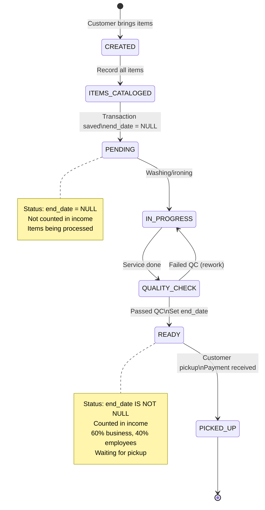

# Laundry Service Flow

**Service Type:** Laundry (Laundry)
**Complexity:** High (Item-based pricing with adjustment logic)
**Frequency:** 30-50 orders per day (estimated)
**Average Duration:** 24-72 hours (multi-day service)

---

## Overview

### Purpose
Process laundry service orders from item drop-off through washing/ironing to customer pickup, with item-level tracking and flexible pricing.

### Business Value
- Item-based service tracking
- Flexible pricing with manual adjustment capability
- Multi-day service lifecycle management
- Second major revenue source

### User Roles Involved
- **Cashier/Front Desk Staff** - Records items, collects payment
- **Service Staff** - Washes and irons items
- **Customer** - Drops off and picks up items

### System Components
- POS System (Frontend)
- Transaction Management API
- Item Cataloging System
- Income Calculation Engine (60/40 split)
- Database (laundry_transactions, laundry_items, laundry_types)

---

## Process Flow Diagram

```mermaid
flowchart TD
    Start([Customer Arrives with Laundry]) --> RecordCustomer[Record Customer Info:\n- Name\n- Phone Number]
    RecordCustomer --> CatalogItems[Begin Item Cataloging]

    CatalogItems --> SelectItem[Select Item Type]
    SelectItem --> CheckType{Item Type\nExists?}
    CheckType -->|No| CreateItemType[Create New Type\nin Settings]
    CheckType -->|Yes| EnterQuantity[Enter Quantity]
    CreateItemType --> EnterQuantity

    EnterQuantity --> CheckUnit{Unit Type?}
    CheckUnit -->|"pcs, kg, lusin"| MarkLaundry[Mark as Laundry Item]
    CheckUnit -->|"m, m2"| MarkCarpet[Mark as Carpet Item]

    MarkLaundry --> AddMore{More Items?}
    MarkCarpet --> AddMore
    AddMore -->|Yes| SelectItem
    AddMore -->|No| CalcTotalPrice[Calculate Total Price:\nsum price × quantity]

    CalcTotalPrice --> ReviewPrice[Display Calculated Price]
    ReviewPrice --> AdjustPrice{Cashier Adjusts\nFinal Price?}
    AdjustPrice -->|No| FinalPrice[final_price = total_price]
    AdjustPrice -->|Yes| ManualPrice[Cashier enters final_price]

    ManualPrice --> CheckAdjustment{final_price vs\ntotal_price?}
    CheckAdjustment -->|Equal| NoDistribution[No price adjustment needed]
    CheckAdjustment -->|Greater| ExtraCharge[Extra charge:\nAdd to first item]
    CheckAdjustment -->|Less| Discount[Discount:\nSubtract sequentially]

    FinalPrice --> CreateTransaction[Create Transaction\nend_date = NULL]
    NoDistribution --> CreateTransaction
    ExtraCharge --> CreateTransaction
    Discount --> CreateTransaction

    CreateTransaction --> SaveItems[Save All Items\nwith adjusted prices]
    SaveItems --> PrintTicket[Print Claim Ticket]
    PrintTicket --> CustomerLeaves[Customer Leaves Items]

    CustomerLeaves --> ProcessingStart[Service Staff:\nWash & Iron Items]
    ProcessingStart --> QualityCheck{Quality\nCheck Pass?}
    QualityCheck -->|No| Rework[Re-wash/Re-iron]
    Rework --> QualityCheck
    QualityCheck -->|Yes| Packaging[Package Items]

    Packaging --> SetEndDate[Mark Ready:\nSet end_date = NOW]
    SetEndDate --> NotifyCustomer[Notify Customer\nOptional SMS]
    NotifyCustomer --> WaitPickup[Wait for Customer Pickup]

    WaitPickup --> CustomerReturns[Customer Returns]
    CustomerReturns --> VerifyItems[Verify Items with Ticket]
    VerifyItems --> ProcessPayment[Process Payment]

    ProcessPayment --> CalcIncome[Calculate Income:\n60% business\n40% employees]
    CalcIncome --> PrintReceipt[Print Receipt]
    PrintReceipt --> UpdateDashboard[Update Dashboard]
    UpdateDashboard --> End([Service Complete])
```



---

## Detailed Process Steps

### Step 1: Customer Information Recording

**User Action:** Customer brings laundry items to counter

**System Action:** Cashier opens laundry module and creates new transaction

**Fields:**
- **Name** (optional) - Customer name
- **Phone Number** (optional) - Contact for notification
- **Start Date** (auto-filled) - When items dropped off

**Business Rules:**
- Name and phone optional (walk-in customers)
- Start date auto-recorded (current date/time)
- No customer account linkage (unlike water delivery)

**UI:** `/laundry/pekerjaan-baru`

**Validation:**
- Name: optional, max 128 characters
- Phone: optional, max 18 characters

---

### Step 2: Item Cataloging

**User Action:** Cashier catalogs each item to be laundered

**System Action:** Display item type selection, quantity input

**Process:**
1. Select item type from `laundry_types`
2. Enter quantity
3. System calculates item subtotal
4. Repeat for all items

**Item Types Examples:**
- Kaos/T-Shirt (Rp 5,000/pcs)
- Kemeja/Shirt (Rp 7,000/pcs)
- Celana/Pants (Rp 8,000/pcs)
- Selimut/Blanket (Rp 15,000/pcs)
- Laundry Kiloan (Rp 8,000/kg)

**API:** `GET /api/laundry-type/`

**Business Rules:**
- Item types with unit != "m" and != "m2" shown (laundry only)
- Each item has: type, quantity, calculated price
- Can add multiple items of same type (no uniqueness constraint)

**Formula per Item:**
```
item_subtotal = laundry_type.price × quantity
```

---

### Step 3: Service Type Differentiation

**System Action:** Classify transaction as Laundry or Carpet based on item units

**Classification Logic:**
```python
is_carpet = False
for item in items:
    if item.unit.lower() in ['m', 'm2']:
        is_carpet = True
        break

if is_carpet:
    service_type = "Carpet Washing"
else:
    service_type = "Laundry"
```

**Business Rules Applied:**
- **LA-WF-001 / CA-WF-001:** Service differentiation by unit
- If ANY item has unit 'm' or 'm2', entire transaction is carpet
- If ALL items have other units (pcs, kg, lusin), transaction is laundry
- Mixed transactions (laundry + carpet items) classified as carpet

**Example Classifications:**
| Items | Units | Classification |
|-------|-------|----------------|
| 5 T-shirts | ["pcs"] | Laundry |
| 2 kg Kiloan | ["kg"] | Laundry |
| 1 Karpet 3x4 | ["m2"] | Carpet |
| 3 Shirts + 1 Carpet | ["pcs", "m2"] | Carpet (has carpet item) |

---

### Step 4: Price Calculation & Adjustment

**User Action:** Review calculated total, optionally adjust final price

**System Action:** Calculate total from all items, allow manual override

**Calculation:**
```python
# Step 1: Calculate total from items
total_price = sum(item.price * item.quantity for item in items)

# Step 2: Cashier can set different final_price
final_price = user_input or total_price  # Can be >, =, or < total_price
```

**Price Adjustment Scenarios:**

**Scenario A: No Adjustment (final_price == total_price)**
```
Items:        Shirt (Rp 7,000) × 3 = Rp 21,000
              Pants (Rp 8,000) × 2 = Rp 16,000
Total:        Rp 37,000
Final Price:  Rp 37,000
Action:       No adjustment needed
```

**Scenario B: Extra Charge (final_price > total_price)**
```
Items:        Same as above
Total:        Rp 37,000
Final Price:  Rp 40,000 (customer charged extra)
Extra:        +Rp 3,000
Action:       Add Rp 3,000 to FIRST item
Result:       Shirt price becomes Rp 24,000 (Rp 21,000 + Rp 3,000)
              Pants price stays Rp 16,000
```

**Scenario C: Discount (final_price < total_price)**
```
Items:        Same as above
Total:        Rp 37,000
Final Price:  Rp 30,000 (discount given)
Discount:     -Rp 7,000
Action:       Subtract sequentially from items

Step 1: Shirt subtotal = Rp 21,000, discount = Rp 7,000
        Shirt price = Rp 21,000 - Rp 7,000 = Rp 14,000
        Remaining discount = Rp 0

Result: Shirt = Rp 14,000, Pants = Rp 16,000
```

**Scenario D: Large Discount (zeroing items)**
```
Items:        Shirt Rp 21,000, Pants Rp 16,000
Total:        Rp 37,000
Final Price:  Rp 20,000
Discount:     -Rp 17,000

Step 1: Shirt = Rp 21,000 - Rp 17,000 = Rp 4,000
        Remaining = Rp 0

OR if discount is -Rp 25,000:
Step 1: Shirt = Rp 21,000 - Rp 21,000 = Rp 0 (zeroed)
        Remaining = Rp 4,000
Step 2: Pants = Rp 16,000 - Rp 4,000 = Rp 12,000

Result: Shirt = Rp 0, Pants = Rp 12,000
```

**Business Rules Applied:**
- **LA-CAL-001:** Item price distribution logic
- First item gets ALL extra charge
- Discount applied sequentially, can zero out early items
- Item prices recalculated to match final_price exactly

---

### Step 5: Transaction Creation

**User Action:** Confirm order, create transaction

**System Action:** Insert transaction and all items into database

**API:** `POST /api/laundry-transaction/`

**Request Body:**
```json
{
  "name": "John Doe",
  "phone_number": "08123456789",
  "start_date": "2025-10-22 10:00:00",
  "final_price": 37000,
  "item": [
    {
      "laundry_type_id": 1,
      "quantity": 3
    },
    {
      "laundry_type_id": 2,
      "quantity": 2
    }
  ]
}
```

**Database Operations:**
```sql
-- 1. Insert transaction
INSERT INTO laundry_transactions (
    name, phone_number, start_date,
    final_price, end_date, created_at, updated_at
) VALUES (
    'John Doe', '08123456789', '2025-10-22 10:00:00',
    37000, NULL, NOW(), NOW()
);

SET @transaction_id = LAST_INSERT_ID();

-- 2. Apply price distribution logic, then insert items
-- (Price adjustment calculated in controller)

INSERT INTO laundry_items (
    laundry_transaction_id, laundry_type_id,
    quantity, created_at, updated_at
) VALUES
    (@transaction_id, 1, 3, NOW(), NOW()),  -- Shirts
    (@transaction_id, 2, 2, NOW(), NOW());  -- Pants
```

**State:** PENDING (end_date = NULL)

---

### Step 6: Processing & Service Execution

**User Action:** Service staff washes and irons items

**System Action:** None (manual service)

**Process:**
1. Items sorted by type and wash requirements
2. Washing machine cycle
3. Drying
4. Ironing (for applicable items)
5. Folding and packaging
6. Quality check

**Duration:** 24-72 hours typical

**Business Rules:**
- No intermediate status updates
- No time tracking
- Manual quality control

**State:** Still PENDING

---

### Step 7: Service Completion & Customer Notification

**User Action:** Staff marks items as ready

**System Action:** Set end_date

**API:** `PUT /api/laundry-transaction/end-date/{id}/`

**Request Body:**
```json
{
  "end_date": "2025-10-24 16:00:00"
}
```

**Database Operation:**
```sql
UPDATE laundry_transactions
SET end_date = '2025-10-24 16:00:00',
    updated_at = NOW()
WHERE laundry_transaction_id = 123;
```

**State Transition:** PENDING → COMPLETED

**Optional:** SMS notification to customer
- "Your laundry is ready for pickup. Transaction #123"
- Not implemented in current system

---

### Step 8: Customer Pickup & Payment

**User Action:** Customer returns to pick up items

**System Action:** Verify items, collect payment

**Process:**
1. Customer provides ticket/transaction number
2. Staff retrieves items
3. Customer verifies items are correct
4. Payment processed
5. Receipt printed

**Payment Methods:**
- Cash
- Bank Transfer
- E-Wallet
- Card

**Note:** Payment tracking not implemented in current system

---

### Step 9: Income Calculation

**System Action:** Calculate income distribution

**Business Rules Applied:**
- **LA-INC-001:** Fixed 60/40 income split (HARDCODED)
- **TX-WF-001:** Only counted if end_date IS NOT NULL

**Calculation:**
```python
gross_income = transaction.final_price  # Rp 37,000
business_income = gross_income * 0.6    # Rp 22,200 (60%)
employee_cost = gross_income * 0.4      # Rp 14,800 (40%)
```

**Income Distribution:**
- **Business Net Income:** Rp 22,200 (60%)
- **Employee/Overhead Cost:** Rp 14,800 (40%)

**Important Notes:**
- Employee cost NOT distributed to individual employees
- No employee tracking like car wash
- 40% goes to business as operational cost
- Hardcoded in `dashboard_controller.py:66, 72, 380, 523`

---

## State Diagram



---

## Integration Points

### Database Tables

**Primary Table:** `laundry_transactions`
```sql
laundry_transaction_id (PK)
name (VARCHAR, nullable) -- Customer name
phone_number (VARCHAR, nullable)
start_date (DATETIME)
end_date (DATETIME, nullable)
final_price (BIGINT)
created_at (DATETIME)
updated_at (DATETIME)
```

**Junction Table:** `laundry_items`
```sql
laundry_transaction_id (FK -> laundry_transactions)
laundry_type_id (FK -> laundry_types)
quantity (INT)
created_at (DATETIME)
updated_at (DATETIME)
-- Note: No composite PK, allows duplicate items
```

**Reference Table:** `laundry_types`
```sql
laundry_type_id (PK)
name (VARCHAR)
price (BIGINT)
unit (VARCHAR) -- "pcs", "kg", "lusin", "m", "m2"
created_at (DATETIME)
updated_at (DATETIME)
```

### API Endpoints Used

| Endpoint | Method | Purpose |
|----------|--------|---------|
| `/api/laundry-type/` | GET | List laundry types (excludes carpet) |
| `/api/laundry-transaction/` | GET | List laundry transactions |
| `/api/laundry-transaction/` | POST | Create new transaction |
| `/api/laundry-transaction/{id}/` | PUT | Update transaction |
| `/api/laundry-transaction/end-date/{id}/` | PUT | Mark as completed |
| `/api/dashboard/income/` | GET | View income (includes laundry) |

---

## Business Rules Summary

### Pricing Rules

**BR-LA-001:** Item-based pricing
- Each item type has base price and unit
- Total calculated as sum of (price × quantity)
- Cashier can override final price

**BR-LA-002:** Price adjustment distribution
- Extra charge: Add to first item
- Discount: Subtract sequentially from items
- Can zero out items if discount exceeds item price

### Income Rules

**BR-LA-003:** Fixed 60/40 split (HARDCODED)
- 60% to business
- 40% to employees/overhead
- Not configurable without code change

**BR-LA-004:** Service type differentiation
- Laundry: units are "pcs", "kg", "lusin", etc.
- If ANY item has unit "m" or "m2", classified as carpet
- Affects reporting but same 60/40 split

### Transaction Rules

**BR-LA-005:** Completion via end_date
- NULL = Pending/In Progress
- NOT NULL = Ready/Completed
- Only completed counted in income

---

## Known Issues & Limitations

### Issue 1: Hardcoded Income Split

**Problem:** 60/40 split hardcoded in controller

**Impact:** Cannot change business rules without deployment

**Location:** `dashboard_controller.py:66, 72, 380, 523`

**Recommendation:** Move to database configuration

### Issue 2: No Employee Tracking

**Problem:** Unlike car wash, laundry has no employee assignment

**Impact:** Cannot track individual employee performance or income

**Recommendation:** Add employee assignment like car wash

### Issue 3: Mixed Transaction Ambiguity

**Problem:** Transaction with both laundry and carpet items classified as carpet

**Impact:** Reporting may be inaccurate

**Recommendation:** Add explicit service_type field

### Issue 4: No Status Granularity

**Problem:** Cannot distinguish pending vs in-progress vs ready

**Impact:** No workflow visibility

**Recommendation:** Add explicit status ENUM

### Issue 5: Price Adjustment Logic Complexity

**Problem:** First-item adjustment not intuitive

**Impact:** Confusing for cashiers and customers

**Recommendation:**
- Document clearly
- Consider proportional distribution instead
- Add UI indicator when adjustment applied

---

## Future Enhancements

### Priority 1: Critical

1. **Make income split configurable**
   - Add to database like car wash
   - Support per-type customization

2. **Add employee tracking**
   - Assign employees to transactions
   - Track individual income

3. **Add explicit status field**
   - PENDING, IN_PROGRESS, READY, PICKED_UP
   - Better workflow management

### Priority 2: Important

4. **Add payment tracking**
   - Payment method
   - Partial payment support
   - Payment status

5. **Add customer notifications**
   - SMS when ready
   - Pickup reminders

6. **Improve price adjustment**
   - Proportional distribution
   - UI indicators
   - Better customer communication

### Priority 3: Nice to Have

7. **Add customer accounts**
   - Track repeat customers
   - Loyalty program
   - Order history

8. **Add service time estimation**
   - Estimated ready time
   - Express service option

---

## Testing Scenarios

### Scenario 1: Simple Order, No Adjustment

**Input:**
- Items: 3 Shirts @ Rp 7,000 = Rp 21,000
- Final Price: Rp 21,000

**Expected:**
- Gross: Rp 21,000
- Business: Rp 12,600 (60%)
- Employees: Rp 8,400 (40%)
- No price adjustment

### Scenario 2: Extra Charge

**Input:**
- Items: 2 Pants @ Rp 8,000 = Rp 16,000
- Final Price: Rp 20,000 (extra Rp 4,000)

**Expected:**
- First item adjusted: Rp 16,000 + Rp 4,000 = Rp 20,000
- Gross: Rp 20,000
- Business: Rp 12,000
- Employees: Rp 8,000

### Scenario 3: Discount, Sequential Subtraction

**Input:**
- Items: Shirt Rp 21,000, Pants Rp 16,000
- Final Price: Rp 30,000 (discount Rp 7,000)

**Expected:**
- Shirt: Rp 21,000 - Rp 7,000 = Rp 14,000
- Pants: Rp 16,000 (no change)
- Total: Rp 30,000

---

## Conclusion

The laundry flow is the most complex service due to:

✅ **Strengths:**
- Item-level tracking
- Flexible pricing with adjustment
- Proven price distribution algorithm
- Multi-day workflow support

⚠️ **Areas for Improvement:**
- Hardcoded income split (critical issue)
- No employee tracking
- Ambiguous service type classification
- No explicit status field
- Complex price adjustment logic

This flow demonstrates the need for:
- Database-driven configuration (like car wash)
- Employee assignment system
- Explicit status management
- Better UI indicators for price adjustments

---

**Last Updated:** October 22, 2025
**Related Documents:**
- business-logic/business-rules-catalog.md (LA-INC-001, LA-WF-001, LA-CAL-001)
- business-logic/workflows/transaction-lifecycle.md
- car-wash-flow.md (comparison)
