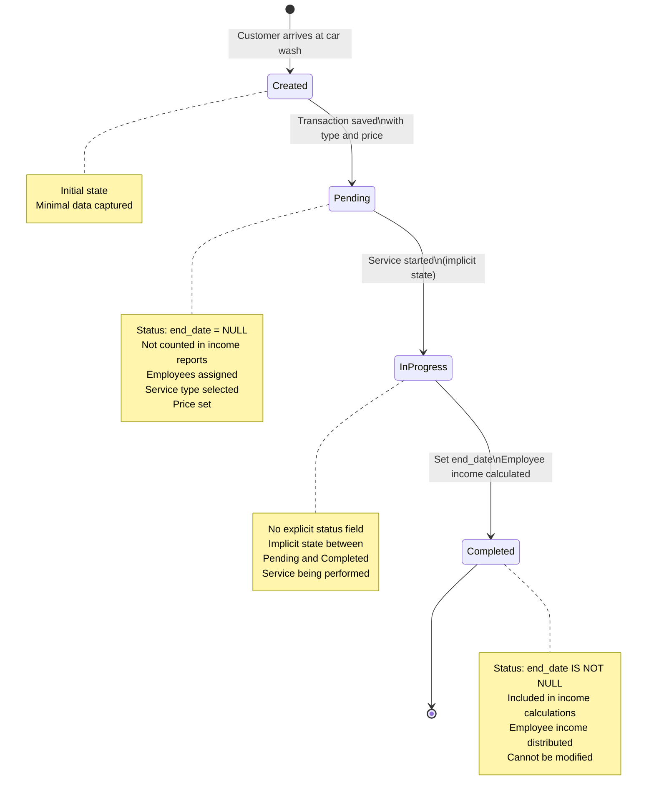

# State Diagrams

**Document Version:** 1.0
**Analysis Date:** October 22, 2025
**Purpose:** State machine documentation for all stateful entities in the Kharisma Abadi system

---

## Overview

This document contains state diagrams for all entities that have state transitions in the system. Each diagram shows:
- All possible states
- Transitions between states
- Trigger events for transitions
- State-specific business rules

---

## 1. Car Wash Transaction States

### State Diagram



### State Details

| State | end_date Value | Income Counted? | Can Modify? | Typical Duration |
|-------|----------------|-----------------|-------------|------------------|
| **Created** | NULL | ❌ No | ✅ Yes | Seconds |
| **Pending** | NULL | ❌ No | ✅ Yes | Minutes to hours |
| **In Progress** | NULL | ❌ No | ✅ Yes | 10-60 minutes |
| **Completed** | IS NOT NULL | ✅ Yes | ❌ No | Permanent |

### Transition Triggers

| From | To | Trigger | API Endpoint | Sets |
|------|-----|---------|--------------|------|
| [*] | Created | Customer arrives | N/A | N/A |
| Created | Pending | Save transaction | `POST /api/carwash-transaction/` | `carwash_type_id`, `final_price`, employees |
| Pending | In Progress | Start service | (No API - implicit) | N/A |
| In Progress | Completed | Finish service | `PUT /api/carwash-transaction/end-date/{id}/` | `end_date = NOW()` |

### Business Rules by State

**Pending:**
- Rule CW-INC-001: Employee cut configured
- Rule CW-INC-002: Multiple employees can be assigned
- Rule CW-VAL-001: No duplicate employee assignments

**Completed:**
- Rule TX-WF-001: Only counted when end_date IS NOT NULL
- Rule CW-INC-002: Employee income distributed (floor division)
- Rule EM-INC-001: Added to employee income aggregations

---

## 2. Laundry/Carpet Transaction States

### State Diagram


### State Details

| State | end_date Value | Income Counted? | Can Modify? | Typical Duration |
|-------|----------------|-----------------|-------------|------------------|
| **Created** | NULL | ❌ No | ✅ Yes | Seconds |
| **Items Cataloged** | NULL | ❌ No | ✅ Yes | Minutes |
| **Pending** | NULL | ❌ No | ✅ Yes | Hours to days |
| **In Progress** | NULL | ❌ No | ✅ Yes | Hours to days |
| **Ready** | IS NOT NULL | ✅ Yes | ❌ No | Until pickup |
| **Picked Up** | IS NOT NULL | ✅ Yes | ❌ No | Permanent |

### Transition Triggers

| From | To | Trigger | API Endpoint | Sets |
|------|-----|---------|--------------|------|
| [*] | Created | Customer drops off | N/A | N/A |
| Created | Items Cataloged | Record items | `POST /api/laundry-transaction/` | `items[]` |
| Items Cataloged | Pending | Calculate price | Same as above | `final_price` |
| Pending | In Progress | Start processing | (No API) | N/A |
| In Progress | Ready | Mark complete | `PUT /api/laundry-transaction/end-date/{id}/` | `end_date = NOW()` |
| Ready | Picked Up | Customer pickup | (No API) | N/A |

### Business Rules by State

**Items Cataloged:**
- Rule LA-CAL-001: Item price distribution applied if `final_price ≠ sum(item_price × quantity)`

**Ready:**
- Rule LA-INC-001 / CA-INC-001: 60% business, 40% employees (hardcoded)
- Rule LA-WF-001: Service classified as laundry or carpet by item unit types
- Rule TX-WF-001: Counted in income when end_date IS NOT NULL

---

## 3. Water Delivery Transaction States

### State Diagram


### State Details

| State | end_date Value | Income Counted? | Can Modify? | Typical Duration |
|-------|----------------|-----------------|-------------|------------------|
| **Customer Select** | N/A | ❌ No | N/A | Seconds |
| **Registered Customer** | NULL | ❌ No | ✅ Yes | Seconds |
| **Walk-in Customer** | NULL | ❌ No | ✅ Yes | Seconds |
| **Order Created** | NULL | ❌ No | ✅ Yes | Seconds |
| **Pending** | NULL | ❌ No | ✅ Yes | Hours to days |
| **Delivered** | IS NOT NULL | ✅ Yes | ❌ No | Permanent |

### Transition Triggers

| From | To | Trigger | API Endpoint | Sets |
|------|-----|---------|--------------|------|
| [*] | Customer Select | Customer orders | N/A | N/A |
| Customer Select | Registered Customer | Select customer | `POST /api/drinking-water-transaction/` | `drinking_water_customer_id` |
| Customer Select | Walk-in Customer | Manual entry | Same | `customer_name`, `phone_number` |
| Registered/Walk-in | Order Created | Create order | Same | `drinking_water_type_id`, `quantity` |
| Order Created | Pending | Set price | Same | `final_price` |
| Pending | Delivered | Confirm delivery | `PUT /api/drinking-water-transaction/end-date/{id}/` | `end_date = NOW()` |

### Business Rules by State

**Customer Select:**
- Rule WA-VAL-001: Optional customer association (can be NULL)

**Delivered:**
- Rule WA-INC-001: 60% business, 40% employees (hardcoded)
- Rule TX-WF-001: Counted in income when end_date IS NOT NULL

---

## 4. Employee Income State (Conceptual)

### State Diagram


### State Details

| State | Condition | Income Visible? | Aggregation |
|-------|-----------|-----------------|-------------|
| **No Income** | No assignments | ❌ No | 0 |
| **Earning Pending** | end_date = NULL | ❌ No | 0 |
| **Income Earned** | end_date IS NOT NULL | ✅ Yes | Per-job income |
| **Income Aggregated** | In reports | ✅ Yes | Summed by period |

### Business Rules

- Rule EM-INC-001: Employee income aggregated by time period (day, month, year, all-time)
- Rule CW-INC-002: Employee income = total_cut // num_employees (floor division)

---

## 5. Transaction Completion State (Generic)

### Universal State Diagram


### Universal Business Rule

**TX-WF-001: Transaction Completion Status**
- **Pending:** `end_date = NULL` → Not counted in income
- **Completed:** `end_date IS NOT NULL` → Counted in income

**Applies to:**
- Car wash transactions
- Laundry/carpet transactions
- Water delivery transactions

---

## 6. Service Type Classification State (Laundry/Carpet)

### State Diagram


### Classification Rules

**LA-WF-001: Service Type Differentiation**
- Check all items in transaction
- If ANY item has `unit = 'm'` OR `unit = 'm2'` → **Carpet**
- Otherwise → **Laundry**

**Edge Case:**
- Mixed transaction (kg + m2 items) → Classified as **Carpet**

---

## 7. State Transition Summary

### By Service Type

**Car Wash:**
- States: 4 (Created → Pending → In Progress → Completed)
- Key transition: Pending → Completed (set end_date)
- Tracked field: `end_date`

**Laundry/Carpet:**
- States: 6 (Created → Items Cataloged → Pending → In Progress → Ready → Picked Up)
- Key transition: In Progress → Ready (set end_date)
- Tracked field: `end_date`

**Water Delivery:**
- States: 4-5 (Customer Select → Order Created → Pending → Delivered)
- Key transition: Pending → Delivered (set end_date)
- Tracked field: `end_date`

### Universal Pattern

All services follow the same core pattern:

```
Created (end_date = NULL)
    ↓
Pending (end_date = NULL)
    ↓
Completed (end_date IS NOT NULL) ← Income counted here
```

---

## 8. State-Based Income Calculation

### Income Inclusion Logic


---

## 9. State Field Mapping

### Database Fields Indicating State

| Service | State Field | Pending Value | Completed Value |
|---------|-------------|---------------|-----------------|
| Car Wash | `end_date` | NULL | DATE (e.g., '2025-10-22') |
| Laundry/Carpet | `end_date` | NULL | DATETIME (e.g., '2025-10-22 14:30:00') |
| Water Delivery | `end_date` | NULL | DATE (e.g., '2025-10-22') |

**Note:** System does NOT have explicit `status` enum field. State is inferred from `end_date` value.

---

## 10. State Transition Constraints

### Cannot Transition Directly

**Car Wash:**
- ❌ Created → Completed (must go through Pending)
- ❌ Completed → Pending (irreversible)

**Laundry/Carpet:**
- ❌ Created → Ready (must catalog items first)
- ❌ Ready → Pending (irreversible)

**Water Delivery:**
- ❌ Created → Delivered (must create order first)
- ❌ Delivered → Pending (irreversible)

### Irreversible Transitions

Once `end_date` is set (transaction completed), it **cannot** be reverted to pending without manual database modification.

**Recommendation for Rebuild:**
- Add explicit "cancel" or "void" functionality
- Track state history (audit log)
- Allow administrative corrections with approval

---

## 11. Implicit vs Explicit States

### Explicit States (Tracked in Database)

- **Pending:** `end_date = NULL`
- **Completed:** `end_date IS NOT NULL`

### Implicit States (Not Tracked)

- **Created:** Momentary state during transaction creation
- **In Progress:** Inferred (pending but service started)
- **Ready:** Same as completed for laundry/carpet
- **Picked Up:** Inferred (completed and customer retrieved items)
- **Delivered:** Same as completed for water delivery

**Recommendation for Rebuild:**
- Consider adding explicit `status` enum field
- Possible values: `pending`, `in_progress`, `ready`, `completed`, `cancelled`, `refunded`
- Provides clearer state tracking and better reporting

---

## Conclusion

**State Management Summary:**
- All services use `end_date` to track completion state
- Pending: `end_date = NULL` (not counted in income)
- Completed: `end_date IS NOT NULL` (counted in income)
- No explicit status field (state inferred from end_date)
- Multiple implicit states (Created, In Progress, Ready, Picked Up)

**For Rebuild:**
- Consider adding explicit `status` enum for clarity
- Track state transition history
- Add cancel/void functionality
- Prevent accidental completion reversal

---

**Last Updated:** October 22, 2025
