# Transaction Lifecycle Workflows

**Document Version:** 1.0
**Analysis Date:** October 22, 2025

---

## Overview

This document visualizes the transaction lifecycle workflows for all services in the Kharisma Abadi system.

---

## 1. Car Wash Transaction Workflow

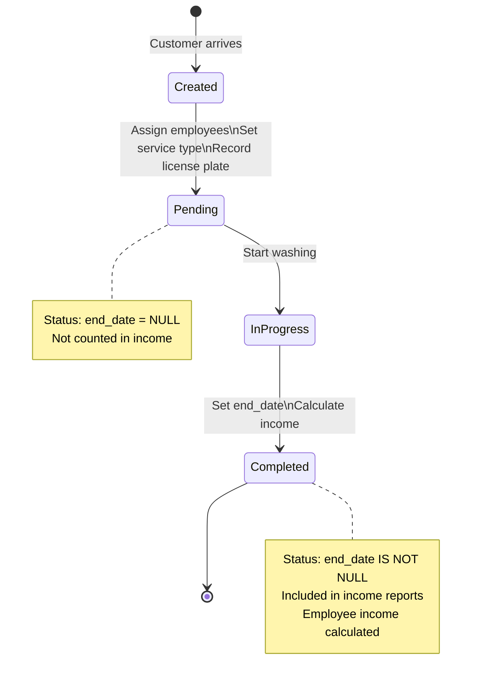

### State Details

| State | end_date | Included in Income? | Actions |
|-------|----------|---------------------|---------|
| **Created** | NULL | ❌ No | Record basic info |
| **Pending** | NULL | ❌ No | Assign employees, set price |
| **In Progress** | NULL | ❌ No | Service being performed |
| **Completed** | Set (DATE) | ✅ Yes | Calculate & distribute income |

### Business Rules Applied

1. **CW-INC-001**: Employee cut calculated (fixed or percentage)
2. **CW-INC-002**: Cut divided among all assigned employees
3. **TX-WF-001**: Only completed (end_date set) counted in income

---

## 2. Laundry/Carpet Transaction Workflow

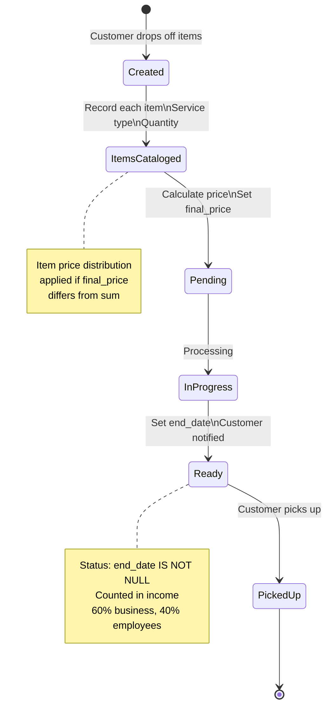

### State Details

| State | end_date | Included in Income? | Actions |
|-------|----------|---------------------|---------|
| **Created** | NULL | ❌ No | Customer info recorded |
| **Items Cataloged** | NULL | ❌ No | List items, types, quantities |
| **Pending** | NULL | ❌ No | Price calculated |
| **In Progress** | NULL | ❌ No | Washing/ironing |
| **Ready** | Set (DATETIME) | ✅ Yes | Items ready for pickup |
| **Picked Up** | Set (DATETIME) | ✅ Yes | Customer retrieved items |

### Service Type Differentiation

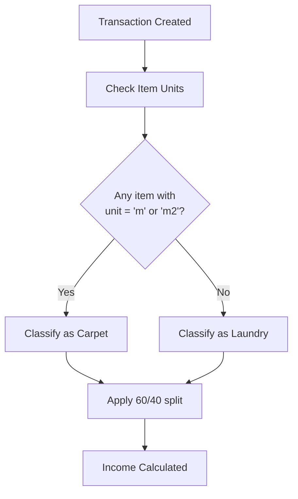

### Business Rules Applied

1. **LA-WF-001 / CA-WF-001**: Service differentiation by unit
2. **LA-INC-001 / CA-INC-001**: 60% business, 40% employees (hardcoded)
3. **LA-CAL-001**: Item price distribution if final_price ≠ sum
4. **TX-WF-001**: Only completed (end_date set) counted

---

## 3. Water Delivery Transaction Workflow

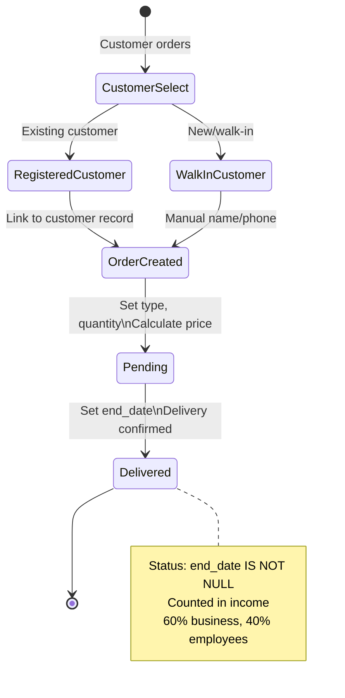

### State Details

| State | end_date | Included in Income? | Actions |
|-------|----------|---------------------|---------|
| **Customer Select** | N/A | ❌ No | Choose customer or walk-in |
| **Order Created** | NULL | ❌ No | Record type, quantity |
| **Pending** | NULL | ❌ No | Awaiting delivery |
| **Delivered** | Set (DATE) | ✅ Yes | Delivery confirmed |

### Customer Type Decision

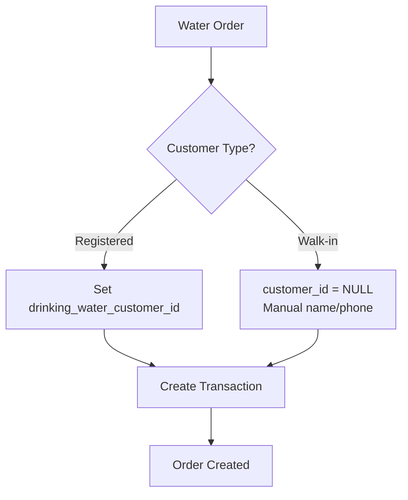

### Business Rules Applied

1. **WA-VAL-001**: Optional customer association
2. **WA-INC-001**: 60% business, 40% employees (hardcoded)
3. **TX-WF-001**: Only completed (end_date set) counted

---

## 4. Income Calculation Workflow

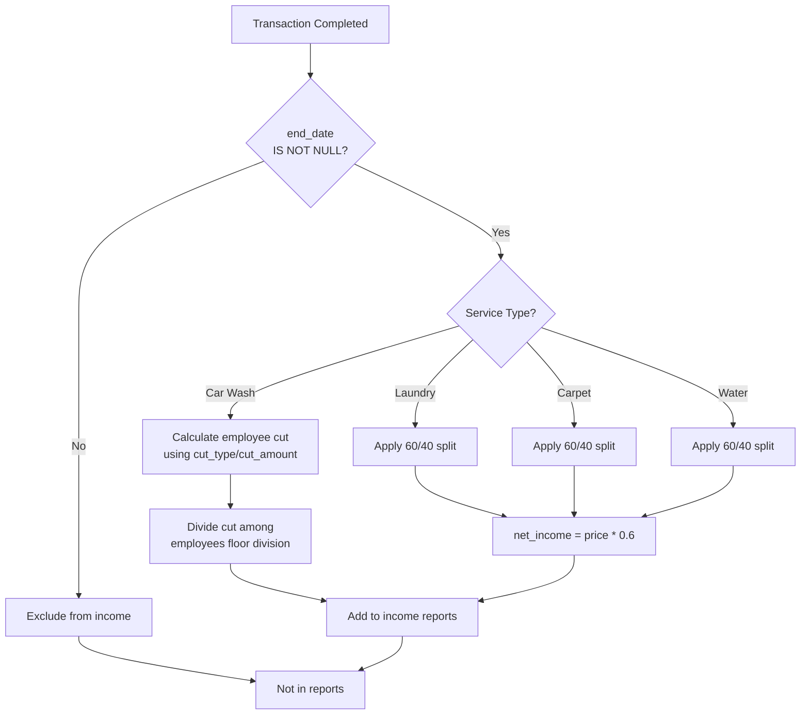

### Income Aggregation

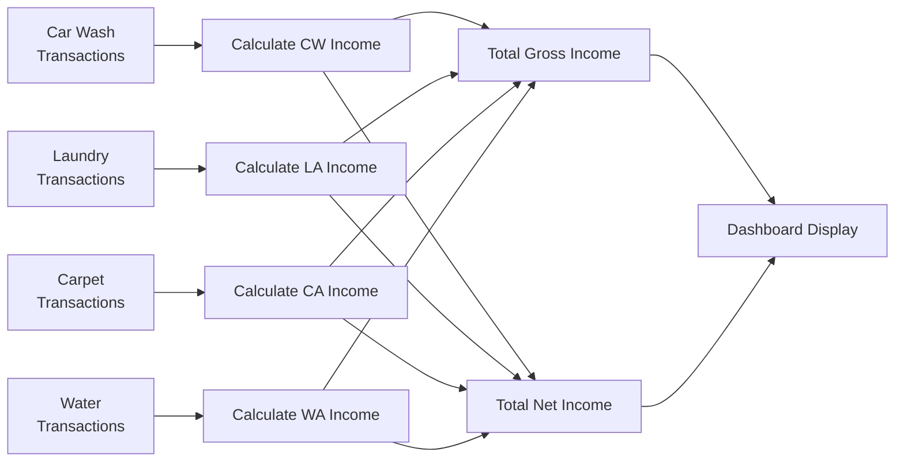

---

## 5. Item Price Distribution Workflow (Laundry/Carpet)

```mermaid
flowchart TD
    Start[Transaction Created] --> CalcTotal[Calculate total_price\nsum of item price * quantity]
    CalcTotal --> Compare{final_price vs\ntotal_price?}
    Compare -->|Equal| NoAdjust[No adjustment needed\nitem_price = price * qty]
    Compare -->|final > total| ExtraCharge[extra = final - total\nAdd to FIRST item]
    Compare -->|total > final| Discount[cut = total - final\nSubtract sequentially]
    ExtraCharge --> AdjustFirst[item[0].item_price =\nprice * qty + extra]
    ExtraCharge --> RestNormal[Other items:\nitem_price = price * qty]
    Discount --> Sequential[For each item:\nif item_price > cut:\n  subtract cut\nelse:\n  zero out item,\n  carry cut forward]
    NoAdjust --> End[Save transaction]
    AdjustFirst --> End
    RestNormal --> End
    Sequential --> End
```

### Example Scenarios

**Scenario 1: Extra Charge (+5,000)**
```
Items:        [10,000, 20,000]
Total Price:  30,000
Final Price:  35,000
Extra:        +5,000

Result:       [15,000, 20,000]
              ↑ First item gets all extra
```

**Scenario 2: Large Discount (-15,000)**
```
Items:        [10,000, 20,000]
Total Price:  30,000
Final Price:  15,000
Discount:     -15,000

Step 1: Item[0] = 10,000 - 10,000 = 0 (zeroed)
        Remaining cut = -5,000

Step 2: Item[1] = 20,000 - 5,000 = 15,000

Result:       [0, 15,000]
```

---

## 6. Employee Income Workflow (Car Wash Only)

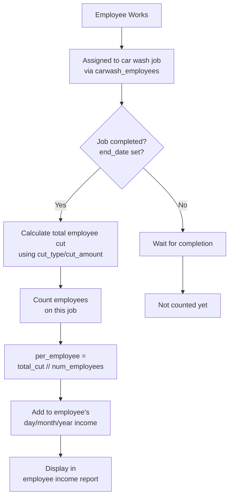

### Income Aggregation Period Filters

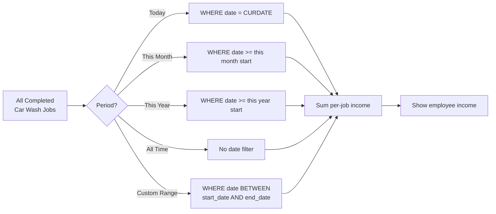

---

## 7. Common Transaction Operations

### Create Transaction

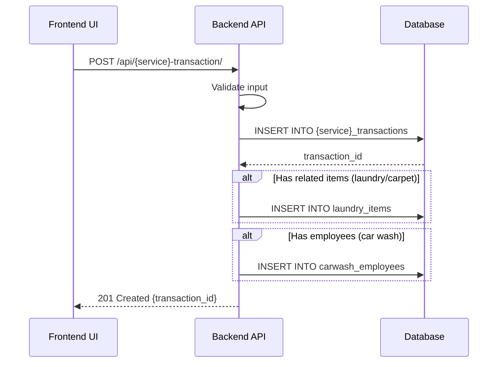

### Update Transaction

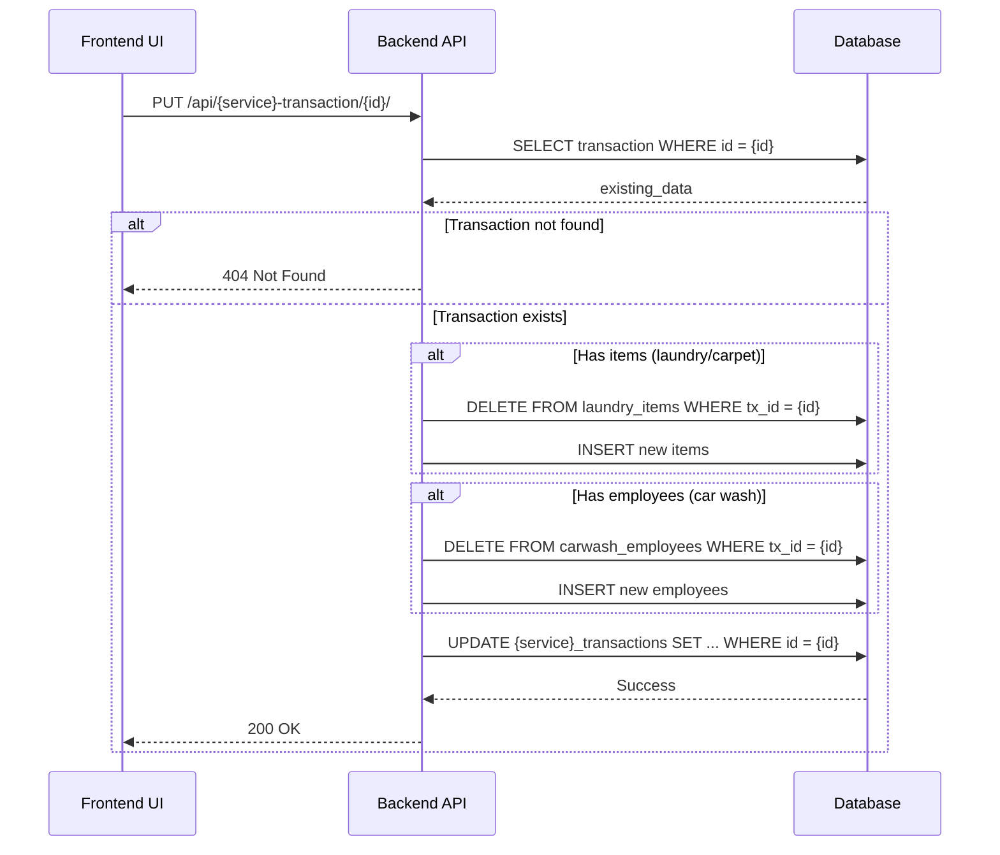

### Complete Transaction

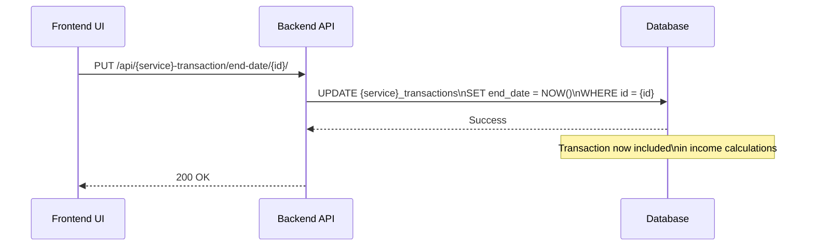

---

## 8. Dashboard Income Calculation Flow

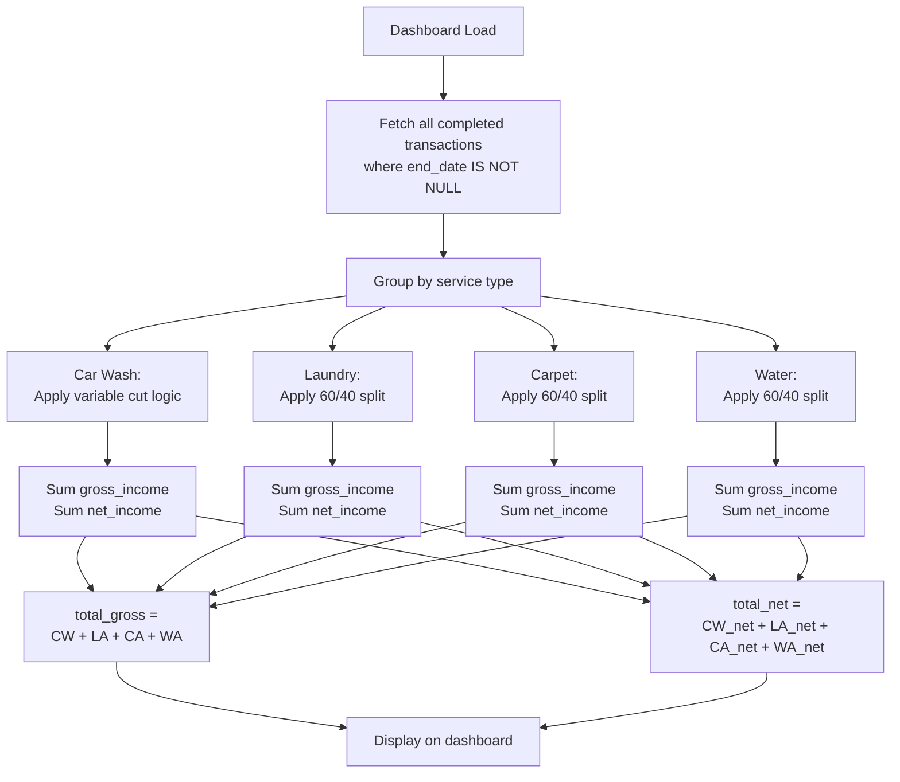

---

## 9. Key Transition Triggers

### What Triggers State Transitions

| Transition | Trigger | API Endpoint | Sets |
|------------|---------|--------------|------|
| **Created → Pending** | Transaction saved | POST /{service}-transaction/ | Basic fields |
| **Pending → In Progress** | (Manual, no API) | N/A | N/A |
| **In Progress → Completed** | Mark as complete | PUT /{service}-transaction/end-date/{id}/ | end_date |

### Critical Status Field

**All Services:**
- `end_date IS NULL` → **Pending** (not counted)
- `end_date IS NOT NULL` → **Completed** (counted in income)

**No intermediate statuses tracked** (in-progress, ready, etc.)

---

## 10. Business Rules Summary by Workflow

| Workflow | Key Business Rules |
|----------|-------------------|
| **Car Wash** | Variable cut (CW-INC-001), Multi-employee division (CW-INC-002) |
| **Laundry/Carpet** | 60/40 split (LA-INC-001), Service differentiation (LA-WF-001), Item price distribution (LA-CAL-001) |
| **Water Delivery** | 60/40 split (WA-INC-001), Optional customer (WA-VAL-001) |
| **Employee Income** | Aggregation (EM-INC-001), Car wash only |
| **Transaction Status** | Completion via end_date (TX-WF-001) |

---

## Conclusion

All services follow a similar **Created → Pending → Completed** lifecycle, with completion triggered by setting `end_date`. The key difference is in **income calculation**:

- **Car Wash:** Configurable, per-employee distribution
- **Laundry/Carpet/Water:** Hardcoded 60/40 split, no employee tracking

**For rebuild:**
- ✅ Preserve the `end_date IS NOT NULL` completion logic
- ✅ Implement the 60/40 split (currently hardcoded)
- ✅ Maintain item price distribution logic
- ⚠️ Consider explicit status enum instead of NULL checks

---

**Last Updated:** October 22, 2025
